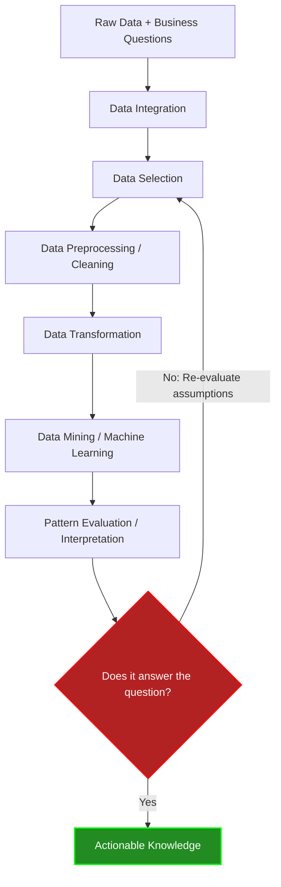

# 2. Intuition and System Architecture

### The Crude Oil Analogy
Think of raw data as crude oil. Crude oil in its natural state is extremely valuable but entirely useless for powering a jet engine. 
1.  **Data Selection** is choosing which oil well to drill.
2.  **Data Preprocessing** is filtering out the sand and water (noise/missing data).
3.  **Data Transformation** is the chemical refinement process (cracking hydrocarbons into specific octanes).
4.  **Data Mining** is combustion in the engine (extracting the power/patterns).
5.  **Evaluation** is checking if the plane actually flies in the right direction.

### The KDD Pipeline Architecture

The KDD process is fundamentally driven by **Data** and **Questions**. It is highly iterative; failure at the evaluation stage requires looping back to earlier stages.

