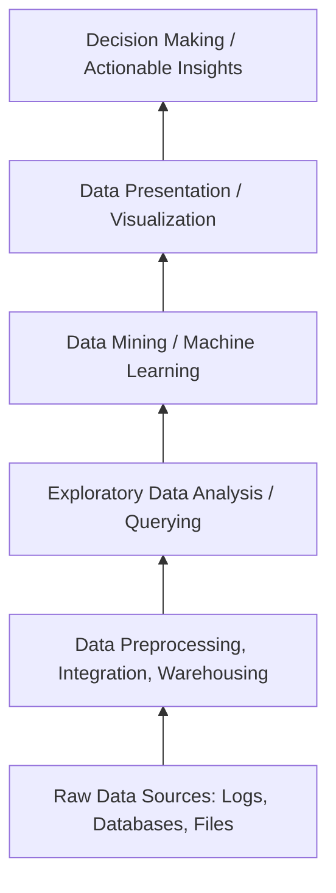

# 6. Business Intelligence (BI) Pyramid

In enterprise architecture, the KDD pipeline is often visualized as a hierarchy of data refinement, known as the Business Intelligence Pyramid.

> [!TIP]
> **Exploratory Data Analysis (EDA):** EDA sits between preprocessing and data mining. It is the phase where you calculate statistical summaries, plot distributions, and visualize correlations. You are *not* applying ML algorithms yet; you are verifying that your transformed data behaves as expected before spending compute cycles on heavy optimization.
