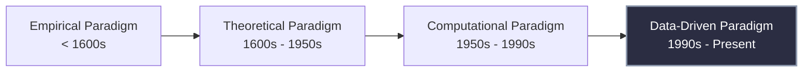

# 3. The Evolution of Scientific Discovery

Science has fundamentally shifted its operational paradigm over the centuries. This evolution is critical to understanding why Data Science is often referred to as the "Fourth Paradigm of Science."

1.  **Empirical:** Observation-based (e.g., sailing ships to map the coast).
2.  **Theoretical:** Mathematical formulations (e.g., Newton's Laws of Motion).
3.  **Computational:** Simulating complex phenomena that are too difficult to calculate analytically (e.g., weather simulation).
4.  **Data-Driven:** Algorithms discover underlying rules directly from massive datasets without explicit physical modeling.
