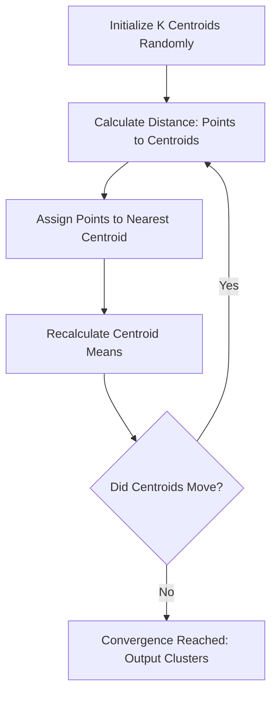

# 2. Clustering: Geometric Pattern Discovery

Clustering is the mathematical process of dividing a dataset into groups such that points within a group are densely packed (high intra-cluster similarity) and distinct groups are far apart (low inter-cluster similarity).

### Mathematical Framework

Let our dataset be $X = \{x_1, x_2, ..., x_n\}$ where each $x_i \in \mathbb{R}^d$. 

We want to partition $X$ into $K$ sets (clusters) $C = \{C_1, C_2, ..., C_K\}$.

To quantify similarity, we rely on a distance metric, most commonly the squared Euclidean distance:

$$
d(x_i, x_j) = ||x_i - x_j||^2_2 = \sum_{m=1}^{d} (x_{im} - x_{jm})^2
$$

> [!IMPORTANT]
> The fundamental objective of partitional clustering (like K-Means) is to minimize the **Within-Cluster Sum of Squares (WCSS)** while implicitly maximizing the **Between-Cluster Sum of Squares (BCSS)**. Distance is inversely proportional to similarity.

The objective function to minimize (WCSS) is defined as:

$$
J = \sum_{k=1}^{K} \sum_{x_i \in C_k} ||x_i - \mu_k||^2
$$

Where $\mu_k$ is the centroid (mean) of cluster $C_k$:

$$
\mu_k = \frac{1}{|C_k|} \sum_{x_i \in C_k} x_i
$$

### Algorithmic Workflow



### Python Implementation: K-Means Clustering Simulation

This example demonstrates how to implement clustering using `scikit-learn`, focusing on generating data, applying the algorithm, and visualizing the geometric boundaries.

```python
import numpy as np
import matplotlib.pyplot as plt
from sklearn.datasets import make_blobs
from sklearn.cluster import KMeans
