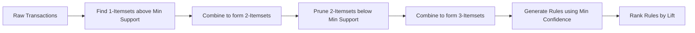

# 3. Association Rule Mining

While clustering finds similar *entities* (rows), Association Rule Mining finds similar *behaviors* or concurrent events (co-occurrence of features/items). It does not predict a continuous value or class; it establishes probabilistic rules.

### Real-World Analogies
1. **Market Basket Analysis:** Supermarkets log transaction data. If an algorithm notices a pattern: "Customers who buy Diapers and Milk frequently buy Beer," the store can physically place these items near each other to optimize sales.
2. **Psychological Association (Marketing):** "Thanda Matlab Coca-Cola" or pairing Samosa with Coke. Marketing campaigns use association rules to hardwire a brand to an emotion or another product in the consumer's mind.

### Mathematical Explanation

Let $I = \{i_1, i_2, ..., i_m\}$ be a set of items (the supermarket inventory).
Let $T = \{t_1, t_2, ..., t_N\}$ be a set of transactions, where each transaction $t_n \subseteq I$.

An association rule is an implication of the form $X \rightarrow Y$, where $X, Y \subset I$ and $X \cap Y = \emptyset$.

We evaluate the strength of a rule using three core statistical metrics:

**1. Support:** 
The probability that a transaction contains both $X$ and $Y$. It measures the baseline frequency of the rule.

$$
Support(X \rightarrow Y) = P(X \cup Y) = \frac{|\{t \in T : (X \cup Y) \subseteq t\}|}{N}
$$

**2. Confidence:** 
The conditional probability that a transaction containing $X$ also contains $Y$.

$$
Confidence(X \rightarrow Y) = P(Y | X) = \frac{Support(X \cup Y)}{Support(X)}
$$

**3. Lift:** 
The ratio of the observed support to the expected support if $X$ and $Y$ were completely independent.

$$
Lift(X \rightarrow Y) = \frac{P(X \cap Y)}{P(X)P(Y)} = \frac{Confidence(X \rightarrow Y)}{Support(Y)}
$$

> [!WARNING]
> High confidence does not imply a strong rule if the consequent ($Y$) is extremely popular anyway. Always check the **Lift**. 
> - Lift > 1: Positive correlation (Complementary items).
> - Lift = 1: Independent items.
> - Lift < 1: Negative correlation (Substitute items).

### Algorithmic Workflow: Apriori Property

Finding all combinations of items leads to a combinatorial explosion ($2^m - 1$ possible itemsets). The Apriori algorithm uses the **Anti-Monotonicity of Support** to prune the search space: *If an itemset is infrequent, all its supersets must also be infrequent.*



### Python Implementation: Market Basket Analysis

This implementation utilizes `mlxtend` to process transaction data and extract mathematical association rules.

```python
import pandas as pd
from mlxtend.preprocessing import TransactionEncoder
from mlxtend.frequent_patterns import apriori, association_rules
