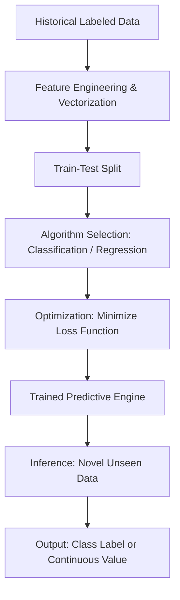

# 2. Visual Intuition & System Architecture

Before diving into the mathematics, it is crucial to understand the computational pipeline of a predictive system.

```mermaid
flowchart TD
    A[Historical Labeled Data] --> B[Feature Engineering & Vectorization]
    B --> C[Train-Test Split]
    C --> D[Algorithm Selection: Classification / Regression]
    D --> E[Optimization: Minimize Loss Function]
    E --> F[Trained Predictive Engine]
    F --> G[Inference: Novel Unseen Data]
    G --> H[Output: Class Label or Continuous Value]
```
