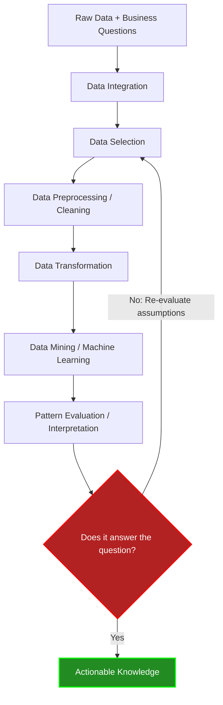
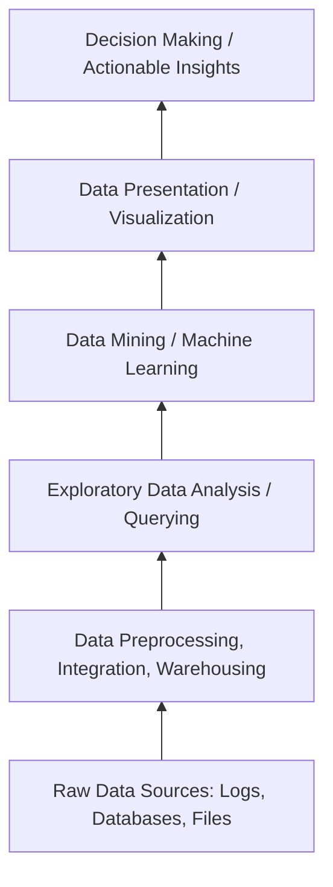

## Knowledge Discovery in Databases (KDD) and the Data Science Pipeline

> [!NOTE]
> Data Science is formally defined as the extraction of non-trivial, implicit, previously unknown, and potentially useful patterns, structures, and knowledge from massive amounts of data. The systematic process to achieve this is known as KDD (Knowledge Discovery in Databases).

## 1. Concept Introduction

To transition from raw, high-entropy data into actionable intelligence, we require a rigorous engineering pipeline. The KDD process represents the standard iterative workflow that governs how data is selected, cleaned, mathematically transformed, mined, and ultimately evaluated against a core business or scientific hypothesis.

### Deconstructing the Definition
*   **Non-trivial:** The patterns discovered must not be obvious (e.g., "sales drop to zero when the store is closed" is trivial).
*   **Implicit:** The knowledge is hidden deep within the multidimensional feature space, not explicitly stored as a queryable database column.
*   **Previously Unknown:** It provides novel insights rather than just reporting historical aggregates.
*   **Potentially Useful:** The output must lead to actionable decision-making (e.g., predicting weather, triggering stock trades).

## 2. Intuition and System Architecture

### The Crude Oil Analogy
Think of raw data as crude oil. Crude oil in its natural state is extremely valuable but entirely useless for powering a jet engine. 
1.  **Data Selection** is choosing which oil well to drill.
2.  **Data Preprocessing** is filtering out the sand and water (noise/missing data).
3.  **Data Transformation** is the chemical refinement process (cracking hydrocarbons into specific octanes).
4.  **Data Mining** is combustion in the engine (extracting the power/patterns).
5.  **Evaluation** is checking if the plane actually flies in the right direction.

### The KDD Pipeline Architecture

The KDD process is fundamentally driven by **Data** and **Questions**. It is highly iterative; failure at the evaluation stage requires looping back to earlier stages.



## 3. Mathematical Formulation of the Pipeline

While KDD is a workflow, it can be mathematically formulated as a series of functional mappings that reduce noise and isolate signal.

Let the raw, multi-source dataset be $\Omega$. We aim to find a mapping $M$ that yields a predictive or descriptive hypothesis $h$.

1.  **Selection ($S$):** Extracting task-relevant subspace $\mathcal{D} \subset \Omega$.
2.  **Preprocessing ($P$):** A mapping that mitigates noise $\epsilon$ and handles undefined spaces (NaNs), resulting in a cleaned domain $X_{clean} = P(\mathcal{D})$.
3.  **Transformation ($T$):** A feature mapping function $\phi: X_{clean} \rightarrow \mathbb{R}^d$ that projects data into a mathematically tractable space (e.g., scaling, orthogonal projection).
4.  **Data Mining ($M$):** An optimization process to minimize a loss function $L$ over the parameters $\theta$:
    

$$
\theta^* = \arg\min_{\theta} \sum_{i=1}^{N} L(y_i, f_\theta(\phi(x_i)))
$$

5.  **Evaluation ($E$):** Checking if the generalization error on unseen data is below a strictly defined threshold $\tau$.

## 4. Differentiating the Triad: Selection, Preprocessing, Transformation

A common trap for engineers is conflating selection, preprocessing, and transformation. They are computationally and logically distinct.

### 1. Data Selection (Subsetting)
*   **Goal:** Filter the dataset to only include relevant records and features based on the business question.
*   **Example:** If predicting tomorrow's *rain*, wind speed and humidity are relevant. The sensor's serial number or maintenance schedule is irrelevant and should be dropped.

### 2. Data Preprocessing (Cleaning)
*   **Goal:** Fix what is "broken" in the selected data.
*   **Operations:** Imputing missing values (NaNs), smoothing noisy data, resolving inconsistencies, and removing severe outliers.
*   **Example:** Sensor 4 occasionally transmits `-999` for humidity. Preprocessing replaces `-999` with the rolling average of the last hour.

### 3. Data Transformation (Structuring)
*   **Goal:** Change the data's mathematical shape to satisfy the assumptions of the downstream algorithm.
*   **Operations:** Normalization ($Z$-score scaling), One-Hot Encoding, Log transformations, or Dimensionality Reduction (PCA).
*   **Example:** A neural network requires input features to have zero mean and unit variance.

> [!IMPORTANT]
> **The order is strictly non-negotiable.** You cannot transform data containing NaNs (math will break). You should not preprocess data you haven't selected (wastes computational resources).

## 5. Python Implementation: The End-to-End KDD Pipeline

This script simulates building a Weather Prediction System (Rain vs. No Rain), explicitly demonstrating the KDD steps.

```python
import pandas as pd
import numpy as np
from sklearn.model_selection import train_test_split
from sklearn.preprocessing import StandardScaler
from sklearn.ensemble import RandomForestClassifier
from sklearn.metrics import accuracy_score, classification_report

## ---------------------------------------------------------
## STEP 0: Raw Data + Question
## Question: Can we predict rain tomorrow based on today's weather?
## ---------------------------------------------------------
np.random.seed(42)
data = {
    'sensor_id': ['S1', 'S2', 'S1', 'S3', 'S2'] * 200,
    'temperature_c': np.random.normal(25, 5, 1000),
    'humidity_%': np.random.normal(60, 15, 1000),
    'wind_direction': np.random.choice(['N', 'S', 'E', 'W'], 1000),
    'maintenance_log': ['Checked'] * 1000,
    'rain_tomorrow': np.random.choice([0, 1], 1000, p=[0.7, 0.3])
}
## Injecting noise/missing data
data['humidity_%'][::15] = np.nan 
data['temperature_c'][::50] = 999 # Sensor error

raw_df = pd.DataFrame(data)

print(f"Raw Data Shape: {raw_df.shape}")

## ---------------------------------------------------------
## STEP 1: Data Selection
## Drop irrelevant columns (sensor_id, maintenance_log, wind_direction for simplicity)
## ---------------------------------------------------------
selected_df = raw_df[['temperature_c', 'humidity_%', 'rain_tomorrow']].copy()

## ---------------------------------------------------------
## STEP 2: Data Preprocessing (Cleaning)
## Handle NaNs and fix extreme outliers
## ---------------------------------------------------------
## Fix outlier
selected_df.loc[selected_df['temperature_c'] == 999, 'temperature_c'] = np.nan
## Impute NaNs with median
clean_df = selected_df.fillna(selected_df.median())

## ---------------------------------------------------------
## STEP 3: Data Transformation
## Scale features to zero mean and unit variance
## ---------------------------------------------------------
X = clean_df[['temperature_c', 'humidity_%']]
y = clean_df['rain_tomorrow']

X_train, X_test, y_train, y_test = train_test_split(X, y, test_size=0.2, random_state=42)

scaler = StandardScaler()
X_train_transformed = scaler.fit_transform(X_train)
X_test_transformed = scaler.transform(X_test)

## ---------------------------------------------------------
## STEP 4: Data Mining / Machine Learning
## ---------------------------------------------------------
clf = RandomForestClassifier(n_estimators=100, random_state=42)
clf.fit(X_train_transformed, y_train)
y_pred = clf.predict(X_test_transformed)

## ---------------------------------------------------------
## STEP 5: Pattern Evaluation
## ---------------------------------------------------------
acc = accuracy_score(y_test, y_pred)
print(f"Evaluation Accuracy: {acc:.2f}")

## Iterative loop check
if acc < 0.75:
    print("\n[WARNING] Knowledge extraction failed to answer the question sufficiently.")
    print("Action: Must reiterate. Need to revisit Data Selection (add wind_direction back) or change ML model.")
else:
    print("\n[SUCCESS] Pipeline successfully extracted actionable patterns.")
```

## 6. Business Intelligence (BI) Pyramid

In enterprise architecture, the KDD pipeline is often visualized as a hierarchy of data refinement, known as the Business Intelligence Pyramid.



> [!TIP]
> **Exploratory Data Analysis (EDA):** EDA sits between preprocessing and data mining. It is the phase where you calculate statistical summaries, plot distributions, and visualize correlations. You are *not* applying ML algorithms yet; you are verifying that your transformed data behaves as expected before spending compute cycles on heavy optimization.

## 7. Advanced Engineering Insights

### Computational Tradeoffs in the Pipeline
*   **Where time is spent:** In industry, ~80% of compute time and human engineering effort is spent in Steps 1-3 (Selection, Preprocessing, Transformation). The Data Mining step (Step 4) is often just a few lines of code calling optimized C++ libraries.
*   **Data Leakage during Transformation:** A critical failure occurs if you apply `StandardScaler.fit()` to your *entire* dataset before splitting it. This allows statistical information (mean/variance) from the test set to "leak" into the training set, artificially inflating your Evaluation metrics. Transformations must be strictly fit on training data only.

## 8. Final Takeaways & Interview Insights

### Summary
1.  **KDD is iterative:** The pipeline flows backward as often as it flows forward. Poor evaluation means bad data, bad cleaning, or a bad algorithm.
2.  **Selection vs. Preprocessing vs. Transformation:** Select columns $\rightarrow$ Fix broken rows $\rightarrow$ Reshape math geometry.
3.  **The Ultimate Goal:** KDD aims to extract *implicit, non-trivial* knowledge to answer a specific, high-value question.

### Common Interview Questions
1.  *What is the difference between Data Mining and KDD?*
    *   **Answer:** Data Mining is just one specific step (Step 4) *inside* the broader KDD process. KDD encompasses the entire lifecycle from raw data extraction to final business evaluation.
2.  *Why might a model fail at the Evaluation stage even if the Data Mining algorithm converged perfectly?*
    *   **Answer:** This indicates an issue upstream. The Data Selection might have omitted the most predictive features, or the Data Preprocessing might have smoothed out critical anomalies that were actually important signals (e.g., classifying fraud as "noise").
3.  *During KDD, how do you handle data that isn't relevant to your current question but might be useful later?*
    *   **Answer:** You maintain a central Data Warehouse/Data Lake. The KDD pipeline extracts a *Task-Relevant Data* subset into a Data Mart or working memory. The original data is never discarded; it is just filtered out during the *Data Selection* phase for this specific iteration.

Tags: #statistics #machine-learning #data-science #statistical-modelling
