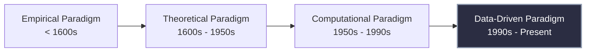

# Introduction to Data Science: Evolution, Architecture, and Foundations

> [!NOTE]
> Data Science is an interdisciplinary paradigm that synthesizes algorithms, statistical methodologies, and distributed systems to extract actionable knowledge and predictive insights from massive volumes of structured and unstructured data.

## 1. Concept Introduction

At its fundamental level, Data Science is the operationalization of mathematics, domain expertise, and computer science to solve real-world problems through data. It bridges the gap between raw data generation and strategic decision-making. 

The field is an intersection of three core domains:
1.  **Computer Science:** Algorithms, data structures, distributed systems, and programming (Python, SQL, C++).
2.  **Mathematics & Statistics:** Probability, hypothesis testing, linear algebra, calculus, and optimization.
3.  **Domain Knowledge:** Contextual understanding of the specific field (e.g., finance, bioinformatics, logistics) to ensure models solve actual business or scientific problems.

## 2. Intuition & The Information Paradox

The primary motivation for modern Data Science can be summarized by a fundamental paradox of the 21st century: 

> [!IMPORTANT]
> **We are drowning in data, but starving for knowledge.**

### Real-World Analogy: The Banking Paradox
Consider the State Bank of India (SBI). Decades ago, transactions were physical, slow, and low in volume. Today, due to the digitalization of physical experiences (UPI, credit cards, online banking), a single bank processes billions of events per day. 

If you ask the raw database: *"Show me the transaction from User A to User B,"* it excels. This is a standard query.
However, if you ask: *"Which of these 1 billion transactions are fraudulent?"* the database fails. 

Standard relational logic cannot easily capture complex, high-dimensional probabilistic patterns. Data Science transforms this raw, high-entropy data into low-entropy, actionable knowledge (detecting the fraud).

## 3. The Evolution of Scientific Discovery

Science has fundamentally shifted its operational paradigm over the centuries. This evolution is critical to understanding why Data Science is often referred to as the "Fourth Paradigm of Science."



1.  **Empirical:** Observation-based (e.g., sailing ships to map the coast).
2.  **Theoretical:** Mathematical formulations (e.g., Newton's Laws of Motion).
3.  **Computational:** Simulating complex phenomena that are too difficult to calculate analytically (e.g., weather simulation).
4.  **Data-Driven:** Algorithms discover underlying rules directly from massive datasets without explicit physical modeling.

## 4. Drivers of the Data Explosion

The exponential growth of data is driven by three infrastructural pillars:

1.  **Automated Data Collection:** IoT sensors, telemetry, web scraping, and satellite imaging constantly push data into central servers. (e.g., Tsunami warning systems with millions of ocean sensors).
2.  **Storage Economics:** The transition from expensive, volatile gigabyte storage to cheap, reliable, and distributed petabyte-scale object storage (e.g., AWS S3, Hadoop HDFS).
3.  **Digitalization of Physical Experiences:** Books to Kindle, physical banking to digital wallets, brick-and-mortar retail to Amazon. Every interaction now leaves a digital exhaust.

## 5. Mathematical Abstraction: Predictive vs. Descriptive Systems

Data Science operationalizes data via two primary modeling approaches.

### Predictive Models (Supervised Learning)
The objective is to map an input vector $x$ to an output $y$ by estimating the conditional probability distribution $P(y | x)$.

$$
\hat{y} = \arg\max_y P(y | x; \theta)
$$

Where $\theta$ represents the learned parameters of the algorithm. 
*   **Classification:** Predicting a discrete class (e.g., Rain / No Rain, Fraud / Genuine).
*   **Regression:** Predicting a continuous continuous value (e.g., Oil Price = ₹105.50).

### Descriptive Models (Unsupervised Learning)
The objective is to learn the underlying structure or the true data-generating distribution $P(x)$ without any given output labels. 

$$
\theta^* = \arg\max_\theta P(X | \theta)
$$

*   **Clustering:** Grouping similar data points (e.g., Customer Segmentation).
*   **Association Rule Mining:** Discovering co-occurrence patterns (e.g., Market Basket Analysis).

## 6. Python Implementation: Resolving the "Starving for Knowledge" Paradox

Let us simulate the banking paradox. We have a massive amount of transaction data, and we need to extract knowledge (fraud detection) using a predictive model.

```python
import numpy as np
import pandas as pd
from sklearn.ensemble import IsolationForest
import matplotlib.pyplot as plt

## 1. Simulate the Data Explosion (Drowning in Data)
## Generating 10,000 genuine transactions and 50 fraudulent ones
np.random.seed(42)

## Genuine transactions: Typical amounts and typical frequencies
genuine_amounts = np.random.normal(loc=500, scale=100, size=10000)
genuine_freq = np.random.normal(loc=5, scale=2, size=10000)

## Fraudulent transactions: Anomalously high amounts, unusual frequencies
fraud_amounts = np.random.uniform(low=5000, high=20000, size=50)
fraud_freq = np.random.uniform(low=20, high=50, size=50)

## Combine into a single structured dataset
amounts = np.concatenate([genuine_amounts, fraud_amounts])
frequencies = np.concatenate([genuine_freq, fraud_freq])
X = np.column_stack((amounts, frequencies))
df = pd.DataFrame(X, columns=['Transaction_Amount', 'Daily_Frequency'])

print(f"Total Transactions Logged: {len(df)}")
## Human analysts cannot manually scan 10,050 rows to find the 50 frauds reliably.

## 2. Extracting Knowledge via Data Science (Machine Learning)
## Using Isolation Forest (an unsupervised anomaly detection algorithm)
## It isolates anomalies (frauds) based on feature space density.
model = IsolationForest(contamination=0.005, random_state=42) # 0.5% expected fraud
df['Prediction'] = model.fit_predict(df[['Transaction_Amount', 'Daily_Frequency']])

## Map predictions: 1 (Inlier/Genuine), -1 (Outlier/Fraud)
df['Is_Fraud'] = df['Prediction'].apply(lambda x: True if x == -1 else False)

## 3. Visual Intuition of the Extracted Knowledge
plt.figure(figsize=(10, 6))

## Plot Genuine Transactions
plt.scatter(
    df[df['Is_Fraud'] == False]['Transaction_Amount'], 
    df[df['Is_Fraud'] == False]['Daily_Frequency'], 
    c='blue', alpha=0.5, label='Genuine (Signal)'
)

## Plot Fraudulent Transactions
plt.scatter(
    df[df['Is_Fraud'] == True]['Transaction_Amount'], 
    df[df['Is_Fraud'] == True]['Daily_Frequency'], 
    c='red', marker='x', s=100, label='Fraud (Anomaly)'
)

plt.title("Data Science in Action: Extracting Fraud Knowledge from Raw Data")
plt.xlabel("Transaction Amount ($)")
plt.ylabel("Transaction Frequency (per day)")
plt.legend()
plt.grid(True, alpha=0.3)
plt.show()

print(f"Identified Fraudulent Transactions:\n{df[df['Is_Fraud'] == True].head(3)}")
```

> [!TIP]
> **Performance/Computational Insight:** In production systems (like SBI or Visa), you cannot load billions of rows into a single Pandas DataFrame. You must utilize distributed computing frameworks like **Apache Spark** (PySpark) which partitions the dataset across a cluster of thousands of worker nodes, applying transformations in parallel.

## 7. Real-World Applications by Domain

Data Science acts as the analytical engine across various verticals:

1.  **Healthcare:** 
    *   *Predictive:* Convolutional Neural Networks (CNNs) processing medical imagery (X-Rays, MRIs) to classify cells as malignant or benign.
    *   *Predictive:* Modeling patient history to predict the probability of a myocardial infarction (heart attack).
2.  **Finance:**
    *   *Predictive:* Real-time fraud detection pipelines.
    *   *Descriptive/Predictive:* Algorithmic high-frequency trading engines that identify statistical arbitrage opportunities in milliseconds.
3.  **Marketing & E-Commerce:**
    *   *Descriptive:* Customer segmentation (grouping users by buying habits).
    *   *Predictive/Descriptive:* Recommendation systems (e.g., Amazon, Netflix) utilizing collaborative filtering to map user-item interaction matrices.
4.  **Logistics & Environment:**
    *   *Predictive:* Route optimization, estimating traffic delays, and forecasting PM 2.5 air pollution levels using time-series forecasting algorithms (ARIMA, LSTMs).

## 8. Common Mistakes & Hidden Assumptions

*   **Confusing Correlation with Causation:** An algorithm might find that ice cream sales and shark attacks are highly correlated. A naive data scientist might conclude one causes the other. The hidden variable (confounder) is *summer weather*.
*   **Garbage In, Garbage Out (GIGO):** The most sophisticated deep learning model will produce useless predictions if the underlying data is structurally flawed, biased, or highly noisy. Data preprocessing often consumes 70-80% of a data scientist's time.
*   **Ignoring Computational Scaling:** Building a model that works on a 10MB CSV file locally, but catastrophically failing (OOM - Out of Memory) when deployed against a 10TB database in production.

## 9. Final Takeaways & Interview Preparation

### Mental Models
*   **The Data Science Translation:** Think of Data Science as a compiler. It compiles high-entropy, chaotic reality (raw logs, images, text) into a low-entropy, structured format (predictions, business decisions, automated actions).
*   **The Venn Diagram:** Whenever you face a data science problem, evaluate your strategy across the three pillars: Do I have the math? Do I have the code? Do I understand the business context?

### High-Frequency Interview Questions
1.  *What is the fundamental difference between structured and unstructured data?*
    *   **Answer:** Structured data exists in predefined schemas (relational databases, CSVs) with strict data types. Unstructured data has no predefined schema (raw text, audio, images, logs). Deep Learning has revolutionized our ability to extract features directly from unstructured data.
2.  *Why is the current era called the "Data-Driven Paradigm" of science?*
    *   **Answer:** Because we no longer rely strictly on humans deriving physical equations first. We feed massive amounts of empirical data into neural networks, which inherently learn the non-linear mappings and governing dynamics without explicit programming.
3.  *Explain the phrase: "Drowning in data, starving for knowledge."*
    *   **Answer:** It highlights the gap between storage capacity and analytical capability. Having 10 petabytes of user logs is just "data". Knowing which 5% of users will churn next week is "knowledge". Data Science bridges this gap.

### Advanced Learning Roadmap
*   **Information Theory:** Study Shannon Entropy to mathematically quantify the "amount of information" inside a dataset.
*   **Distributed Systems:** Learn MapReduce, Hadoop, and Apache Spark architecture to understand how data science operates at the petabyte scale.
*   **Statistical Inference:** Deepen your understanding of MLE (Maximum Likelihood Estimation) and MAP (Maximum A Posteriori) to ground machine learning in rigorous probability theory.
