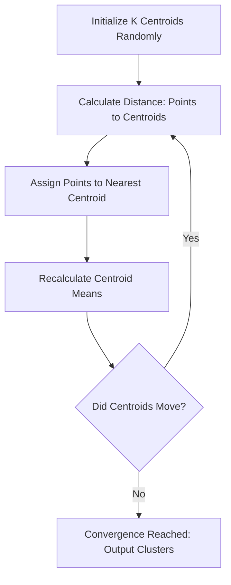
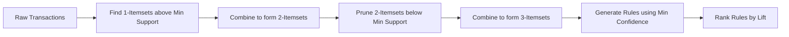

# Descriptive Methods in Machine Learning: Clustering and Association Rule Mining

> [!NOTE]
> Descriptive methods (unsupervised learning) focus on finding inherent structures, underlying patterns, and summaries within data without a predefined target variable. Unlike predictive methods (supervised learning) that map inputs to known outputs, descriptive methods answer the question: "What is the natural state and relationship within this data?"

## 1. Core Intuition of Descriptive Methods

Descriptive algorithms operate in a space where ground truth labels do not exist. They rely entirely on the geometric and probabilistic relationships between data points. 

### Real-World Analogies
1. **Geopolitical Boundaries:** Consider the reorganization of Indian states in 1947. The country was not divided randomly; states were formed based on a shared feature—local language (e.g., Tamil in Tamil Nadu, Marathi in Maharashtra). People speaking the same language possessed high *similarity* and were grouped together, whereas distinct language groups formed the *boundaries* between states.
2. **Google News Aggregation:** Every day, thousands of news articles are published. Google News applies descriptive clustering to group articles into buckets (e.g., "International Politics", "Local Sports"). Articles with similar term frequencies are placed in the same cluster, vastly improving user navigation without human labeling.

## 2. Clustering: Geometric Pattern Discovery

Clustering is the mathematical process of dividing a dataset into groups such that points within a group are densely packed (high intra-cluster similarity) and distinct groups are far apart (low inter-cluster similarity).

### Mathematical Framework

Let our dataset be $X = \{x_1, x_2, ..., x_n\}$ where each $x_i \in \mathbb{R}^d$. 

We want to partition $X$ into $K$ sets (clusters) $C = \{C_1, C_2, ..., C_K\}$.

To quantify similarity, we rely on a distance metric, most commonly the squared Euclidean distance:

$$
d(x_i, x_j) = ||x_i - x_j||^2_2 = \sum_{m=1}^{d} (x_{im} - x_{jm})^2
$$

> [!IMPORTANT]
> The fundamental objective of partitional clustering (like K-Means) is to minimize the **Within-Cluster Sum of Squares (WCSS)** while implicitly maximizing the **Between-Cluster Sum of Squares (BCSS)**. Distance is inversely proportional to similarity.

The objective function to minimize (WCSS) is defined as:

$$
J = \sum_{k=1}^{K} \sum_{x_i \in C_k} ||x_i - \mu_k||^2
$$

Where $\mu_k$ is the centroid (mean) of cluster $C_k$:

$$
\mu_k = \frac{1}{|C_k|} \sum_{x_i \in C_k} x_i
$$

### Algorithmic Workflow



### Python Implementation: K-Means Clustering Simulation

This example demonstrates how to implement clustering using `scikit-learn`, focusing on generating data, applying the algorithm, and visualizing the geometric boundaries.

```python
import numpy as np
import matplotlib.pyplot as plt
from sklearn.datasets import make_blobs
from sklearn.cluster import KMeans

# 1. Generate synthetic data representing customer segments (e.g., spending vs. frequency)
X, y_true = make_blobs(
    n_samples=500, 
    centers=4, 
    cluster_std=0.60, 
    random_state=42
)

# 2. Initialize and fit the KMeans algorithm
# Using 'k-means++' ensures smarter centroid initialization to avoid local minima
kmeans_model = KMeans(
    n_clusters=4, 
    init='k-means++', 
    n_init=10, 
    max_iter=300, 
    random_state=42
)
cluster_assignments = kmeans_model.fit_predict(X)
centroids = kmeans_model.cluster_centers_

# 3. Visual Intuition
plt.figure(figsize=(10, 6))

# Plot the grouped data points
plt.scatter(
    X[:, 0], X[:, 1], 
    c=cluster_assignments, 
    cmap='viridis', 
    s=30, 
    alpha=0.6,
    label='Data Points'
)

# Plot the learned centroids
plt.scatter(
    centroids[:, 0], centroids[:, 1], 
    c='red', 
    s=200, 
    marker='X', 
    label='Cluster Centroids'
)

plt.title("Market Segmentation: Minimizing Intra-Cluster Distance")
plt.xlabel("Feature 1: Purchase Frequency (Normalized)")
plt.ylabel("Feature 2: Annual Spending (Normalized)")
plt.legend()
plt.grid(True, alpha=0.3)
plt.show()

# 4. Extracting Mathematical Properties
print(f"Algorithm Converged in {kmeans_model.n_iter_} iterations.")
print(f"Final WCSS (Inertia): {kmeans_model.inertia_:.2f}")
```

> [!TIP]
> **Computational Complexity:** The time complexity of standard Lloyd's algorithm for K-Means is $O(n \cdot K \cdot I \cdot d)$, where $n$ is points, $K$ is clusters, $I$ is iterations, and $d$ is dimensions. This makes it linearly scalable, which is highly desirable in production systems.

## 3. Association Rule Mining

While clustering finds similar *entities* (rows), Association Rule Mining finds similar *behaviors* or concurrent events (co-occurrence of features/items). It does not predict a continuous value or class; it establishes probabilistic rules.

### Real-World Analogies
1. **Market Basket Analysis:** Supermarkets log transaction data. If an algorithm notices a pattern: "Customers who buy Diapers and Milk frequently buy Beer," the store can physically place these items near each other to optimize sales.
2. **Psychological Association (Marketing):** "Thanda Matlab Coca-Cola" or pairing Samosa with Coke. Marketing campaigns use association rules to hardwire a brand to an emotion or another product in the consumer's mind.

### Mathematical Explanation

Let $I = \{i_1, i_2, ..., i_m\}$ be a set of items (the supermarket inventory).
Let $T = \{t_1, t_2, ..., t_N\}$ be a set of transactions, where each transaction $t_n \subseteq I$.

An association rule is an implication of the form $X \rightarrow Y$, where $X, Y \subset I$ and $X \cap Y = \emptyset$.

We evaluate the strength of a rule using three core statistical metrics:

**1. Support:** 
The probability that a transaction contains both $X$ and $Y$. It measures the baseline frequency of the rule.

$$
Support(X \rightarrow Y) = P(X \cup Y) = \frac{|\{t \in T : (X \cup Y) \subseteq t\}|}{N}
$$

**2. Confidence:** 
The conditional probability that a transaction containing $X$ also contains $Y$.

$$
Confidence(X \rightarrow Y) = P(Y | X) = \frac{Support(X \cup Y)}{Support(X)}
$$

**3. Lift:** 
The ratio of the observed support to the expected support if $X$ and $Y$ were completely independent.

$$
Lift(X \rightarrow Y) = \frac{P(X \cap Y)}{P(X)P(Y)} = \frac{Confidence(X \rightarrow Y)}{Support(Y)}
$$

> [!WARNING]
> High confidence does not imply a strong rule if the consequent ($Y$) is extremely popular anyway. Always check the **Lift**. 
> - Lift > 1: Positive correlation (Complementary items).
> - Lift = 1: Independent items.
> - Lift < 1: Negative correlation (Substitute items).

### Algorithmic Workflow: Apriori Property

Finding all combinations of items leads to a combinatorial explosion ($2^m - 1$ possible itemsets). The Apriori algorithm uses the **Anti-Monotonicity of Support** to prune the search space: *If an itemset is infrequent, all its supersets must also be infrequent.*



### Python Implementation: Market Basket Analysis

This implementation utilizes `mlxtend` to process transaction data and extract mathematical association rules.

```python
import pandas as pd
from mlxtend.preprocessing import TransactionEncoder
from mlxtend.frequent_patterns import apriori, association_rules

# 1. Raw Transactional Data
transactions = [
    ['Milk', 'Diaper', 'Beer', 'Eggs'],
    ['Milk', 'Diaper', 'Beer', 'Cola'],
    ['Milk', 'Diaper', 'Samosa'],
    ['Eggs', 'Cola', 'Samosa'],
    ['Milk', 'Diaper', 'Beer', 'Cola', 'Samosa']
]

# 2. Transform data into a Boolean matrix (One-Hot Encoding format)
encoder = TransactionEncoder()
encoded_array = encoder.fit(transactions).transform(transactions)
df_transactions = pd.DataFrame(encoded_array, columns=encoder.columns_)

print("Boolean Transaction Matrix:")
print(df_transactions.head())

# 3. Apply Apriori to find frequent itemsets (min_support = 0.6 means itemset must appear in 3/5 transactions)
frequent_itemsets = apriori(df_transactions, min_support=0.6, use_colnames=True)

# 4. Generate Association Rules
rules = association_rules(frequent_itemsets, metric="confidence", min_threshold=0.7)

# Sort by Lift to find the most impactful business rules
rules = rules.sort_values(by='lift', ascending=False)

print("\nDiscovered Association Rules:")
# Displaying specific columns for readability
print(rules[['antecedents', 'consequents', 'support', 'confidence', 'lift']])
```

### Interpretation of Output
If the output shows `{Diaper} -> {Beer}` with a Lift of 1.25, it mathematically proves that a customer buying a diaper is 1.25 times *more likely* to buy beer compared to a customer chosen at random.

## 4. Advanced Engineering Notes

### The Curse of Dimensionality in Clustering
As the number of dimensions $d$ increases, the concept of Euclidean distance becomes meaningless. The distance between the nearest data point and the farthest data point converges.
*   *Fix:* Apply dimensionality reduction (PCA, t-SNE, UMAP) before applying distance-based clustering algorithms.

### FP-Growth vs. Apriori
Apriori requires scanning the database multiple times (once for each $k$-itemset generation). For massive datasets (e.g., Amazon logs), this I/O overhead is unacceptable. 
*   *Fix:* FP-Growth (Frequent Pattern Growth) builds a specialized Trie (FP-Tree) in memory, requiring only two database scans, drastically reducing computational overhead.

## 5. Final Takeaways

### Summary
1.  **Descriptive Analytics** extracts underlying structures (clusters) and behaviors (associations) without target variables.
2.  **Clustering** optimizes a geometric objective function (minimizing WCSS) to group similar entities.
3.  **Association Rule Mining** relies on joint and conditional probabilities (Support, Confidence, Lift) to find co-occurring events.

### Interview Questions
1.  *How do you handle categorical variables in K-Means clustering?*
    *   **Answer:** You cannot natively use Euclidean distance on one-hot encoded categories effectively. You must use K-Modes (which uses Hamming distance) or Gower's distance.
2.  *Why is Lift a better metric than Confidence in Market Basket Analysis?*
    *   **Answer:** Confidence does not account for the base probability of the consequent. If you have a rule `A -> Milk` with 90% confidence, it sounds great until you realize 95% of *all* customers buy Milk anyway. Lift accounts for this baseline, preventing false positive rules.
3.  *What happens if you run K-Means with $K = N$ (where $N$ is the number of data points)?*
    *   **Answer:** The WCSS drops exactly to 0, as every point becomes its own centroid. This is the extreme case of overfitting in unsupervised learning.

### Common Traps
*   **Assuming Clustering is Objective:** The choice of distance metric dictates the cluster shape. Euclidean assumes spherical clusters; Mahalanobis accounts for variance and covariance (elliptical clusters).
*   **Spurious Associations:** A high lift score in rule mining does not imply causality. It merely implies statistical co-occurrence.

### Advanced Learning Roadmap
*   **Density-Based Clustering:** Study DBSCAN and HDBSCAN to understand how to cluster non-spherical data and handle noise/outliers inherently.
*   **Probabilistic Clustering:** Study Gaussian Mixture Models (GMM) and the Expectation-Maximization (EM) algorithm to understand soft-assignment clustering.
*   **Sequence Mining:** Extend Association Rules to time-series data (e.g., PrefixSpan) to predict what a user will buy *next week* based on what they bought *this week*.