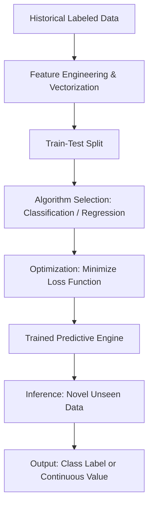

# Predictive Methods in Machine Learning: Supervised Learning Foundations

> [!NOTE]
> Predictive methods, fundamentally known as Supervised Learning, form the backbone of modern applied machine learning. Unlike descriptive methods that seek hidden structures in unlabeled data, predictive methods map an input feature space to a predefined target space using historical labeled examples.

## 1. Concept Introduction

At its core, a predictive method attempts to approximate an unknown underlying function that governs the relationship between variables. In supervised learning, the algorithm is provided with a dataset consisting of input-output pairs. The objective is to learn a mapping capable of predicting the output for novel, unseen inputs with minimal error.

Predictive methods bifurcate into two primary mathematical regimes based on the nature of the target variable:
1.  **Classification:** The target space is finite and discrete. The model acts as a decision boundary generator.
2.  **Regression:** The target space is continuous and theoretically infinite. The model acts as a hyperplane or curve fitter.

## 2. Visual Intuition & System Architecture

Before diving into the mathematics, it is crucial to understand the computational pipeline of a predictive system.



## 3. The Mathematical Framework

Let the input feature space be $\mathcal{X} \in \mathbb{R}^d$ and the target space be $\mathcal{Y}$. 
We are given a training dataset $\mathcal{D}$ with $N$ independently and identically distributed (i.i.d.) observations:

$$
\mathcal{D} = \{(x_1, y_1), (x_2, y_2), \dots, (x_N, y_N)\}
$$

The goal is to find a hypothesis function $h_\theta: \mathcal{X} \rightarrow \mathcal{Y}$ parameterized by weights $\theta$, such that $h_\theta(x)$ is a good approximation of $y$.

To quantify "good approximation," we define a loss function $L(y, \hat{y})$ that computes the penalty of predicting $\hat{y}$ when the true label is $y$. The algorithm minimizes the Empirical Risk (average loss over the training set):

$$
J(\theta) = \frac{1}{N} \sum_{i=1}^{N} L(y_i, h_\theta(x_i))
$$

> [!IMPORTANT]
> The fundamental theorem of predictive modeling is that we do not care about minimizing $J(\theta)$ on the training data $\mathcal{D}$. We care about minimizing the expected risk on the true, unknown data generating distribution $P(X, Y)$. This gap is the core of generalization and the bias-variance tradeoff.

## 4. Classification: Predicting Finite States

In classification, the target space $\mathcal{Y}$ is a finite set of discrete categories. 
*   **Binary Classification:** $\mathcal{Y} \in \{0, 1\}$
*   **Multiclass Classification:** $\mathcal{Y} \in \{1, 2, \dots, K\}$

### Real-World Engineering Use Cases
*   **Tax Cheat Detection:** Given historical ITR (Income Tax Return) parameters, predict $\mathcal{Y} \in \{\text{Fraud}, \text{Genuine}\}$.
*   **Banking Fraud:** An ATM swipe must be evaluated under strict latency constraints (<50ms) to predict $\mathcal{Y} \in \{\text{Fraud}, \text{Legitimate}\}$.
*   **Customer Churn (Uber/Ola):** Predict whether a user will abandon the platform $\mathcal{Y} \in \{\text{Churn}, \text{Retain}\}$. This dictates coupon allocation logic.

### Mathematical Breakdown: Logistic Regression
Despite its name, Logistic Regression is a fundamental linear classification algorithm. It predicts the probability that an observation belongs to the positive class.

To map the linear combination of inputs $\theta^T x$ to a valid probability space $[0, 1]$, we pass it through the Sigmoid function $\sigma(z)$:

$$
P(y=1 | x; \theta) = \frac{1}{1 + e^{-\theta^T x}}
$$

The objective is to minimize the Binary Cross-Entropy (Log-Loss) function, derived from Maximum Likelihood Estimation (MLE):

$$
L(\theta) = - \frac{1}{N} \sum_{i=1}^{N} \left[ y_i \log(\hat{y}_i) + (1 - y_i) \log(1 - \hat{y}_i) \right]
$$

### Python Implementation: Customer Churn Classification

```python
import numpy as np
import pandas as pd
from sklearn.model_selection import train_test_split
from sklearn.linear_model import LogisticRegression
from sklearn.metrics import accuracy_score, precision_score, recall_score

# 1. Simulate Historical Customer Data
np.random.seed(42)
n_samples = 1000

# Features: [Days_Since_Last_Ride, Total_Rides_Last_Month, App_Opens_Last_Week]
X = np.random.normal(loc=[15, 10, 5], scale=[5, 3, 2], size=(n_samples, 3))

# Ground truth generation: Higher days since last ride + lower engagement = higher churn probability
logits = 0.5 * X[:, 0] - 0.8 * X[:, 1] - 1.2 * X[:, 2]
probabilities = 1 / (1 + np.exp(-logits))
y = (probabilities > 0.5).astype(int) # 1 = Churn, 0 = Retain

# 2. Train-Test Split
X_train, X_test, y_train, y_test = train_test_split(X, y, test_size=0.2, random_state=42)

# 3. Initialize and Train the Predictive Engine
clf = LogisticRegression()
clf.fit(X_train, y_train)

# 4. Inference and Evaluation
y_pred = clf.predict(X_test)
y_prob = clf.predict_proba(X_test)[:, 1]

print("Classification Performance Engine:")
print(f"Accuracy:  {accuracy_score(y_test, y_pred):.4f}")
print(f"Precision: {precision_score(y_test, y_pred):.4f}")
print(f"Recall:    {recall_score(y_test, y_pred):.4f}")

# Simulating a production decision: Push a $10 coupon if Churn probability > 70%
sample_user = np.array([[20, 2, 1]]) # 20 days since ride, 2 rides last month, 1 app open
churn_risk = clf.predict_proba(sample_user)[0][1]

print(f"\nProduction Rule Engine:")
if churn_risk > 0.70:
    print(f"User Churn Risk: {churn_risk:.2%}. ACTION: Trigger Coupon Push.")
else:
    print(f"User Churn Risk: {churn_risk:.2%}. ACTION: Do nothing.")
```

## 5. Regression: Predicting the Infinite

In regression, the target space $\mathcal{Y}$ is continuous, meaning $\mathcal{Y} \in \mathbb{R}$. The model predicts a specific magnitude, price, or continuous coordinate.

### Real-World Engineering Use Cases
*   **Commodity Price Prediction:** Predicting tomorrow's petrol or gold price. The state space is continuous ($100.50, $100.51, $100.52...).
*   **Meteorological Systems:** Predicting exact wind velocity in km/h based on continuous features like atmospheric pressure and humidity.

### Mathematical Breakdown: Ordinary Least Squares (OLS)
For a linear regression model, the hypothesis is simply the dot product of the feature vector and the weight vector:

$$
\hat{y} = h_\theta(x) = \theta_0 + \theta_1 x_1 + \theta_2 x_2 + \dots + \theta_d x_d = \theta^T x
$$

The standard loss function is the Mean Squared Error (MSE), geometrically representing the squared Euclidean distance between the predicted plane and the actual data points:

$$
J(\theta) = \frac{1}{2N} \sum_{i=1}^{N} (\hat{y}_i - y_i)^2
$$

> [!TIP]
> The squared term in MSE aggressively penalizes large outliers. If your financial prediction dataset contains heavy-tailed noise (e.g., massive unpredictable market crashes), consider using Mean Absolute Error (MAE) or Huber Loss to increase algorithmic robustness against outliers.

### Python Implementation: Continuous Price Prediction

```python
import numpy as np
import matplotlib.pyplot as plt
from sklearn.linear_model import Ridge
from sklearn.metrics import mean_squared_error

# 1. Simulate Commodity Data (e.g., Gold Price driven by Inflation Rate and Supply)
np.random.seed(100)
n_days = 200

# Feature: Inflation index (normalized)
X_inflation = np.linspace(1, 10, n_days).reshape(-1, 1)

# True underlying function + Gaussian Noise
true_weights = 15.5
bias = 1000
noise = np.random.normal(0, 10, size=(n_days, 1))

y_price = bias + (true_weights * X_inflation) + noise

# 2. Train the Predictive Engine (Ridge Regression adds L2 Regularization)
regressor = Ridge(alpha=1.0)
regressor.fit(X_inflation, y_price)

y_pred = regressor.predict(X_inflation)

# 3. Visual Intuition
plt.figure(figsize=(10, 5))
plt.scatter(X_inflation, y_price, color='gray', alpha=0.6, label='Actual Daily Prices')
plt.plot(X_inflation, y_pred, color='red', linewidth=2, label='Regression Hyperplane (Prediction)')
plt.title("Commodity Price Prediction (Regression)")
plt.xlabel("Inflation Index")
plt.ylabel("Price (USD)")
plt.legend()
plt.grid(True, alpha=0.3)
plt.show()

# 4. Diagnostics
mse = mean_squared_error(y_price, y_pred)
print(f"Model Intercept (Bias): {regressor.intercept_[0]:.2f}")
print(f"Model Coefficient (Weight): {regressor.coef_[0][0]:.2f}")
print(f"Mean Squared Error (MSE): {mse:.2f}")
```

## 6. Computational & Performance Insights

When deploying predictive methods in production systems, algorithm selection is constrained by system architecture:

1.  **Latency vs. Complexity:** A massive deep neural network might predict fraud with 99% accuracy but takes 200ms to compute. An ATM gateway might drop the connection if a response isn't received in 50ms. In such cases, simpler models like Logistic Regression or optimized XGBoost trees are mandated.
2.  **Class Imbalance in Classification:** In fraud detection, legitimate transactions outnumber frauds 10,000 to 1. A naive classifier predicting "Legitimate" 100% of the time will have 99.99% accuracy but is entirely useless.
    *   *Solution:* Use Precision-Recall curves, F1-scores, and techniques like SMOTE (Synthetic Minority Over-sampling Technique) or class-weight adjustments in the loss function.

## 7. Common Mistakes & Hidden Assumptions

*   **Data Leakage:** Including data in the training set that will not be available at inference time. For example, using "Account Closed Date" to predict customer churn. The model will perfectly predict churn because the account is already closed.
*   **Extrapolation in Regression:** Linear models are globally linear. If you train a petrol price predictor on data from 2010-2020 where prices ranged from $50-$100, the model has no mathematical safety net if an anomaly pushes the input space completely outside the training distribution.
*   **Assuming Independence:** Standard supervised learning assumes rows are independent. If predicting stock prices, yesterday's price heavily influences today's. You must use Time-Series specific formulations (ARIMA, LSTMs) rather than standard i.i.d. regression.

## 8. Final Takeaways & Interview Preparation

### Mental Models
*   **Classification** = Drawing borders on a map. You are defining territories.
*   **Regression** = Building a bridge over uneven terrain. You are finding the surface of best fit.

### High-Frequency Interview Questions
1.  **What is the difference between Classification and Regression?**
    *   *Answer:* Classification maps inputs to a discrete, finite set of classes (predicting probabilities via Cross-Entropy). Regression maps inputs to a continuous, mathematically infinite vector space (predicting magnitudes via MSE).
2.  **Why can't we use Mean Squared Error for Classification?**
    *   *Answer:* If you use MSE with a non-linear activation like Sigmoid, the loss landscape becomes non-convex. This means Gradient Descent is highly likely to get trapped in local minima. Cross-Entropy ensures a strictly convex loss landscape for logistic regression.
3.  **How do you handle categorical string variables in a regression model?**
    *   *Answer:* Mathematical models cannot multiply strings. You must map them to numerical spaces using One-Hot Encoding (for nominal data) or Ordinal Encoding (for ranked data).

### Advanced Learning Roadmap
*   **Discriminative vs. Generative Models:** Understand why Logistic Regression is discriminative (models $P(Y|X)$) while Naive Bayes is generative (models $P(X,Y)$).
*   **Support Vector Machines (SVM):** The mathematical translation of classification into a margin-maximization problem using the kernel trick.
*   **Ensemble Methods:** Bagging (Random Forests) and Boosting (Gradient Boosting Machines) to reduce the variance and bias of predictive engines.