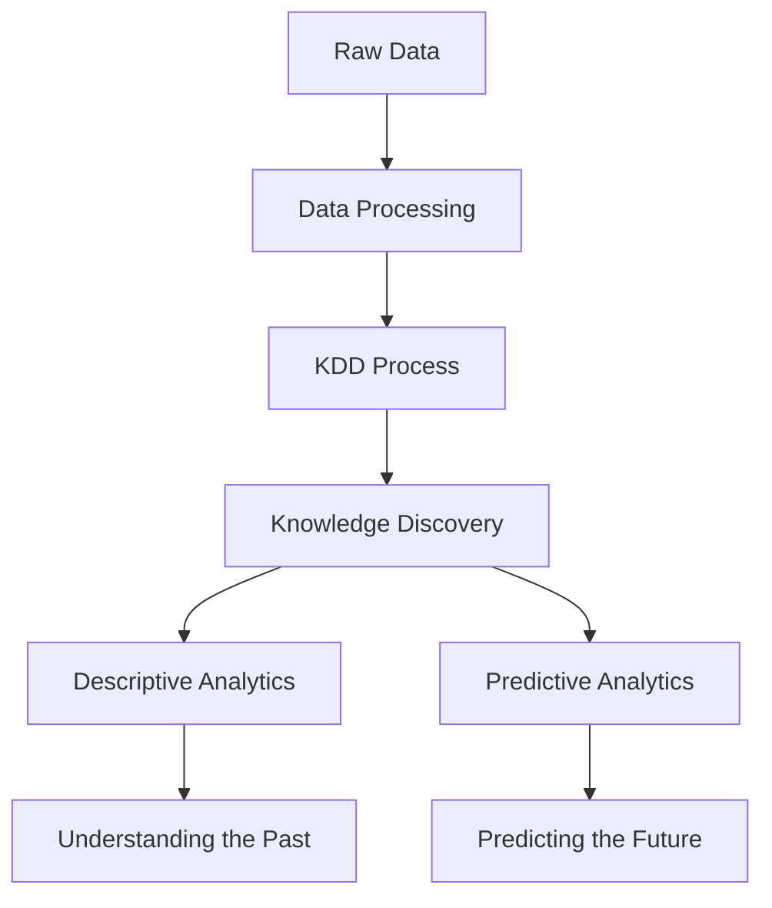

# Lesson 2: Foundations of Data Science and Knowledge Discovery

## Overview

Data Science is an interdisciplinary field that combines statistics, mathematics, computer science, domain expertise, and data engineering techniques to extract meaningful insights from data.

Organizations today generate enormous volumes of data from business transactions, websites, sensors, social media platforms, healthcare systems, and numerous other sources. Raw data by itself provides little value unless it is transformed into actionable knowledge.

This lesson introduces the fundamental concepts that form the basis of modern Data Science. It explores how data is converted into useful information through data processing and Knowledge Discovery in Databases (KDD). The lesson also distinguishes between descriptive and predictive analytical methods, which represent two major categories of data analysis.

Understanding these concepts is essential before studying advanced topics such as machine learning, statistical modeling, and artificial intelligence.

## Learning Objectives

After completing this lesson, you should be able to:

- Define Data Science and explain its interdisciplinary nature.
- Understand the relationship between data, information, knowledge, and wisdom.
- Describe the Knowledge Discovery in Databases (KDD) process.
- Explain the major stages involved in data processing.
- Differentiate between descriptive and predictive analytical methods.
- Identify practical applications of descriptive and predictive analytics.
- Recognize how data-driven decision making supports modern organizations.

## Topics Covered

### 1. [Define Data Science](Define%20Data%20Science.md)

Introduces the concept of Data Science as a multidisciplinary field that integrates:

- Statistics
- Computer Science
- Mathematics
- Machine Learning
- Domain Knowledge
- Data Engineering

The topic also explores:

- The role of a Data Scientist.
- The Data Science lifecycle.
- Real-world applications of Data Science.
- The importance of data-driven decision making.

### 2. [Data Processing & KDD](Data%20Processing%20%26%20KDD.md)

Raw data often contains noise, inconsistencies, duplicates, and missing values. Data processing transforms this raw data into a form suitable for analysis.

This section introduces the Knowledge Discovery in Databases (KDD) process, which typically consists of:

1. Data Selection
2. Data Cleaning
3. Data Integration
4. Data Transformation
5. Data Mining
6. Pattern Evaluation
7. Knowledge Presentation

The KDD framework provides a systematic methodology for extracting useful knowledge from large datasets.

### 3. [Descriptive Methods](Descriptive%20Methods.md)

Descriptive methods focus on understanding historical and existing data.

These techniques answer questions such as:

- What happened?
- How many?
- How often?
- What patterns exist?

Common descriptive techniques include:

- Summary statistics
- Data visualization
- Clustering
- Association analysis
- Reporting and dashboards

Descriptive analytics helps organizations understand current performance and identify trends or anomalies.

### 4. [Predictive Methods](Predictive%20Methods.md)

Predictive methods use historical data to forecast future outcomes.

These methods answer questions such as:

- What is likely to happen?
- What will sales be next month?
- Which customers are likely to churn?
- What risks may occur?

Common predictive techniques include:

- Regression
- Classification
- Time Series Forecasting
- Machine Learning Models

Predictive analytics enables organizations to make proactive and informed decisions.

## Conceptual Relationship

## Lesson Navigation

| Topic | Description |
|--------|-------------|
| [Define Data Science](Define%20Data%20Science.md) | Introduction to the field of Data Science and its interdisciplinary nature |
| [Data Processing & KDD](Data%20Processing%20%26%20KDD.md) | Learn how raw data is transformed into actionable knowledge |
| [Descriptive Methods](Descriptive%20Methods.md) | Techniques used to summarize and understand historical data |
| [Predictive Methods](Predictive%20Methods.md) | Methods used to forecast future events and outcomes |

## Key Takeaways

- Data Science combines multiple disciplines to extract meaningful insights from data.
- Data processing prepares raw data for analysis.
- KDD provides a structured framework for discovering knowledge from data.
- Descriptive methods summarize and explain historical data.
- Predictive methods forecast future outcomes using historical patterns.
- Together, these techniques enable data-driven decision making across industries.
