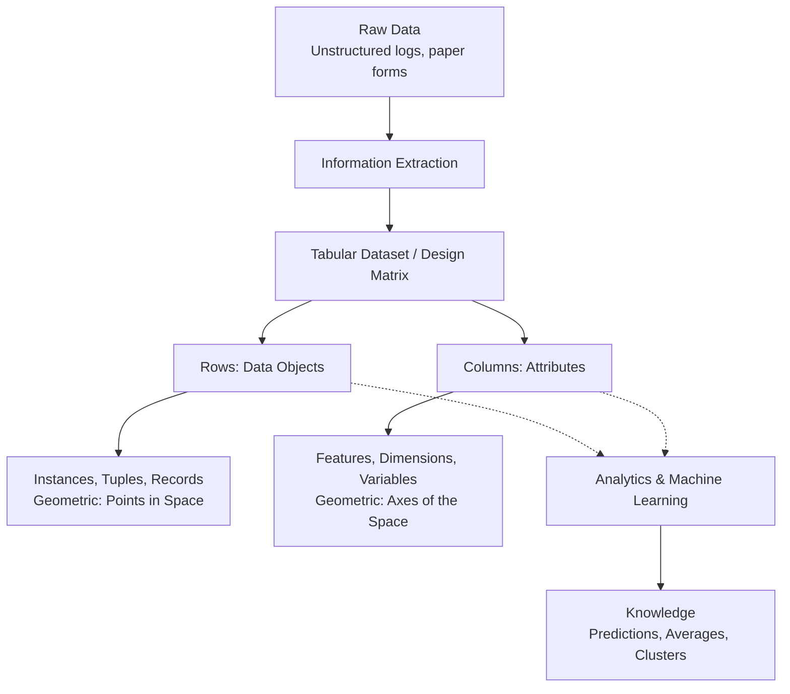

# 4. Visualizing the Dataset Architecture

```mermaid
flowchart TD
    A[Raw Data\nUnstructured logs, paper forms] --> B[Information Extraction]
    B --> C[Tabular Dataset / Design Matrix]
    
    C --> D[Rows: Data Objects]
    D --> E[Instances, Tuples, Records\nGeometric: Points in Space]
    
    C --> F[Columns: Attributes]
    F --> G[Features, Dimensions, Variables\nGeometric: Axes of the Space]
    
    D -.-> H[Analytics & Machine Learning]
    F -.-> H
    H --> I[Knowledge\nPredictions, Averages, Clusters]
```
