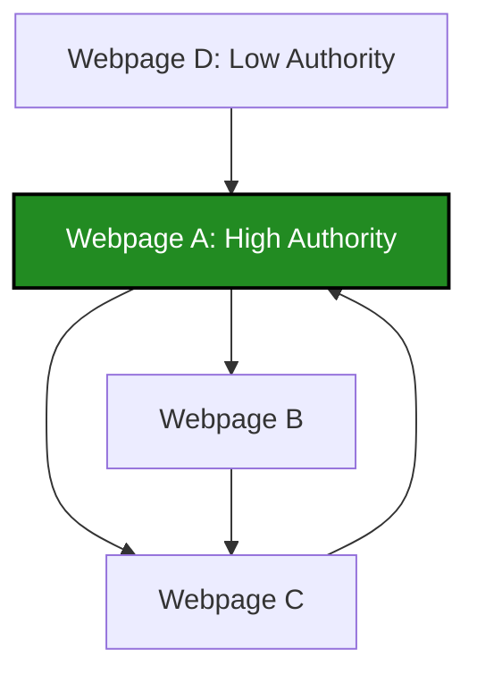

# 3. Graphical Data: Networks and Topologies

When the *relationship* between objects is more important than the objects themselves, we use Graphical Data structures. 

### Real-World Analogy: Google PageRank
In the year 2000, analyzing web pages purely as Document Data (text frequency) was failing because search engines were easily manipulated by keyword stuffing. Google revolutionized search by treating the internet as a **Directed Graph**:
*   **Nodes ($V$):** Web pages.
*   **Edges ($E$):** Hyperlinks connecting pages.

### Mathematical Formulation: Adjacency and PageRank
A graph $G = (V, E)$ is computationally represented as an Adjacency Matrix $A$, where $A_{ij} = 1$ if a link exists from page $i$ to page $j$, and $0$ otherwise.

The original PageRank algorithm models a "random surfer" navigating the web. The importance (Rank) of a page $i$ is defined recursively:

$$
PR(i) = \frac{1-d}{N} + d \sum_{j \in M(i)} \frac{PR(j)}{L(j)}
$$

Where:
*   $PR(i)$: PageRank of page $i$.
*   $d$: Damping factor (usually 0.85, probability the surfer continues clicking).
*   $M(i)$: The set of pages that link to page $i$.
*   $L(j)$: The number of outbound links on page $j$.
*   $N$: Total number of pages.

### Visual Intuition: Directed Web Graph


*Notice how A receives links from D and C, making it a central node. In PageRank, a link from a highly-ranked node (like A) passes more "voting power" to B and C.*

### Python Implementation: Simulating PageRank on Graphical Data

```python
import networkx as nx
import matplotlib.pyplot as plt
