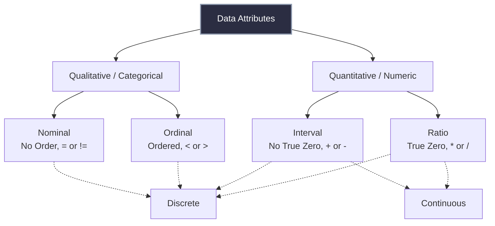

# 4. System Architecture: The Data Hierarchy

```mermaid
flowchart TD
    A[Data Attributes] --> B[Qualitative / Categorical]
    A --> C[Quantitative / Numeric]
    
    B --> D[Nominal\nNo Order, = or !=]
    B --> E[Ordinal\nOrdered, < or >]
    
    C --> F[Interval\nNo True Zero, + or -]
    C --> G[Ratio\nTrue Zero, * or /]
    
    D -.-> H[Discrete]
    E -.-> H
    F -.-> H
    G -.-> H
    
    F -.-> I[Continuous]
    G -.-> I
    
    style A fill:#2b2d42,stroke:#8d99ae,stroke-width:2px,color:#fff
```
