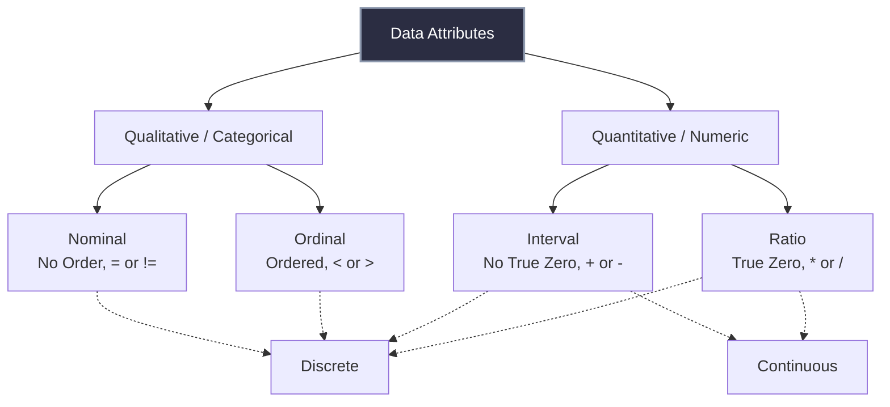

## Data Attributes and Measurement Scales in Machine Learning

> [!NOTE]
> In data science, an attribute (feature, dimension, or variable) is a measurable property of an observed phenomenon. Understanding the exact mathematical typology of an attribute is not merely descriptive—it strictly dictates the algebraic operations, statistical metrics, and machine learning transformations that are legally permissible on that feature space.

## 1. Concept Introduction

Before any algorithm can process a dataset, the geometric and algebraic nature of its dimensions must be mapped. The psychologist Stanley Smith Stevens defined four fundamental scales of measurement that govern data attributes: **Nominal, Ordinal, Interval, and Ratio**. 

Additionally, across these scales, data is structurally classified by its cardinality into **Discrete** (finite or countably infinite states) or **Continuous** (uncountably infinite states).

## 2. Intuition and Real-World Analogies

Imagine teaching a machine how to interpret different types of numbers. 
*   If you hand the machine two zip codes, `10001` and `10002`, it must understand that adding them together to get `20003` is mathematically meaningless. They are just labels (Nominal).
*   If you hand it sizes `Small (1)`, `Medium (2)`, and `Large (3)`, it must know that `3 > 1`, but it cannot assume the volume difference between Medium and Small is exactly the same as Large and Medium (Ordinal).
*   If you tell it the year is `2020` and `2024`, it knows 4 years have passed (Interval), but year `2000` is not "twice as late" as year `1000` because the year `0` is an arbitrary human construct, not an absolute absence of time.
*   If you give it a salary of `$100,000` and `$50,000`, it knows the first is exactly twice as large as the second, and `$0` means absolute bankruptcy (Ratio).

## 3. Mathematical Classification of Attributes

Let $X$ be an attribute and $x_i, x_j$ be distinct observations of $X$. We define the set of permissible operators $\Omega$ for each scale.

### 3.1 Qualitative (Categorical) Data

**1. Nominal Attributes**
*   **Definition:** Values represent distinct symbols, categories, or labels.
*   **Permissible Math:** Equality. $\Omega = \{=, \neq\}$
*   **Statistical Measure:** Mode, Entropy.
*   **Examples:** Zip Codes, Employee IDs, Eye Color, IP Addresses.

$$
x_i = x_j \quad \lor \quad x_i \neq x_j
$$

**2. Ordinal Attributes**
*   **Definition:** Values have a meaningful sequence, rank, or hierarchy, but the magnitude of difference between ranks is undefined.
*   **Permissible Math:** Equality and Rank. $\Omega = \{=, \neq, <, >, \le, \ge\}$
*   **Statistical Measure:** Median, Percentiles, Rank Correlation (Spearman).
*   **Examples:** T-shirt size (S, M, L), Grades (A, B, C, D, F), Likert Scales (1 to 5 stars).

$$
x_i > x_j \implies \text{Rank}(x_i) > \text{Rank}(x_j)
$$

### 3.2 Quantitative (Numeric) Data

**3. Interval Attributes**
*   **Definition:** Values are ordered, and the exact difference (interval) between them holds physical or mathematical meaning. However, there is no *true zero* (zero does not indicate an absolute lack of the quantity).
*   **Permissible Math:** Equality, Rank, and Difference. $\Omega = \{=, \neq, <, >, +, -\}$
*   **Statistical Measure:** Mean, Standard Deviation, Pearson Correlation.
*   **Examples:** Temperature in Celsius or Fahrenheit (0°C is not "no temperature"), Calendar Dates.

$$
d(x_i, x_j) = |x_i - x_j| \quad \text{(Meaningful distance)}
$$

**4. Ratio Attributes**
*   **Definition:** Values possess all properties of interval data, plus a true, absolute zero. The ratio of two values holds distinct meaning.
*   **Permissible Math:** All arithmetic. $\Omega = \{=, \neq, <, >, +, -, \times, \div\}$
*   **Statistical Measure:** Geometric Mean, Harmonic Mean, Coefficient of Variation.
*   **Examples:** Distance, Mass, Height, Kelvin Temperature, Salary.

$$
r(x_i, x_j) = \frac{x_i}{x_j} \quad \text{(Meaningful magnitude scaling)}
$$

> [!WARNING]
> A common trap in data science is treating Ordinal variables as Interval variables. For example, averaging a 5-star rating system yields a mathematical mean (e.g., 4.2 stars), but the psychological distance between a 1-star and 2-star review is rarely the same as between a 4-star and 5-star review. This violates the interval assumption.

## 4. System Architecture: The Data Hierarchy



## 5. Machine Learning Connections: Feature Engineering

Machine learning algorithms strictly require dense numeric matrices (Ratio/Interval data). They cannot natively compute gradients or distances on strings like "Blue" or "Large". We must mathematically transform these attributes.

### Transformation Formulas

**1. Nominal to Numeric: One-Hot Encoding**
Maps a nominal attribute with $K$ distinct categories into a $K$-dimensional orthogonal vector space.

$$
\phi(x) = [I(x=c_1), I(x=c_2), \dots, I(x=c_K)]^T \in \{0,1\}^K
$$

Where $I$ is the indicator function.

**2. Ordinal to Numeric: Ordinal Encoding**
Maps categories to an integer space preserving monotonicity.

$$
\phi(c_k) = k \quad \text{where } c_1 < c_2 < \dots < c_K
$$

**3. Continuous to Discrete: Discretization (Binning)**
Transforms a continuous ratio/interval variable into an ordinal variable via boundary functions.

$$
\phi(x) = k \quad \text{if } b_{k-1} \le x < b_k
$$

## 6. Python Implementation: The Attribute Processing Pipeline

This implementation demonstrates how to systematically identify and mathematically transform different attribute types using `pandas` and `scikit-learn` to prepare them for a machine learning engine.

```python
import pandas as pd
import numpy as np
from sklearn.preprocessing import OneHotEncoder, OrdinalEncoder, StandardScaler, KBinsDiscretizer

## 1. Constructing a heterogeneous dataset representing various attribute types
data = pd.DataFrame({
    'Employee_ID': ['E01', 'E02', 'E03', 'E04'],       # Nominal (Identifier)
    'Department': ['HR', 'Engineering', 'HR', 'Sales'], # Nominal (Categorical)
    'Performance': ['Low', 'High', 'Medium', 'High'],   # Ordinal
    'Joining_Year': [2015, 2020, 2018, 2022],           # Interval
    'Salary_USD': [55000.50, 120000.00, 75000.75, 90000.25] # Ratio (Continuous)
})

print("--- Original Raw Dataset ---")
print(data)
print("\n")

## 2. Processing Nominal Attributes (One-Hot Encoding)
## We drop Employee_ID as it has no predictive power (cardinality = N)
ohe = OneHotEncoder(sparse_output=False, dtype=int)
dept_encoded = ohe.fit_transform(data[['Department']])
dept_columns = ohe.get_feature_names_out(['Department'])
df_dept = pd.DataFrame(dept_encoded, columns=dept_columns)

## 3. Processing Ordinal Attributes (Ordinal Encoding)
## We must explicitly define the hierarchy array for the algorithm
perf_hierarchy = [['Low', 'Medium', 'High']]
oe = OrdinalEncoder(categories=perf_hierarchy, dtype=int)
data['Performance_Encoded'] = oe.fit_transform(data[['Performance']])

## 4. Processing Interval/Ratio Attributes (Standardization)
## ML models prefer continuous data centered at 0 with unit variance
scaler = StandardScaler()
data[['Joining_Year_Scaled', 'Salary_Scaled']] = scaler.fit_transform(data[['Joining_Year', 'Salary_USD']])

## 5. Continuous to Discrete Transformation (Discretization)
## Binning salary into 3 discrete ordinal brackets (e.g., for tax brackets)
binner = KBinsDiscretizer(n_bins=3, encode='ordinal', strategy='uniform')
data['Salary_Bracket'] = binner.fit_transform(data[['Salary_USD']])

## 6. Final Assembled ML-Ready Design Matrix
ml_ready_matrix = pd.concat([df_dept, data[['Performance_Encoded', 'Joining_Year_Scaled', 'Salary_Scaled', 'Salary_Bracket']]], axis=1)

print("--- ML-Ready Design Matrix (Numeric/Transformed) ---")
print(ml_ready_matrix)
```

### Expected Output Interpretation
*   `Department_Engineering`, `Department_HR`: Orthogonal binary vectors (1 or 0). The model interprets these as distinct axes with equidistant relationships.
*   `Performance_Encoded`: Mapped strictly to 0, 1, and 2. The model understands $2 > 1 > 0$.
*   `Salary_Scaled`: Ratio data projected into a $Z$-distribution where negative values denote below-average salaries.

> [!TIP]
> **Performance Insight:** When operating on massive Pandas DataFrames, always convert Nominal text columns to the `category` datatype (`df['col'] = df['col'].astype('category')`). Under the hood, Pandas maps strings to highly compressed integers and stores the dictionary map once. This reduces RAM footprint by up to 90% for high-row, low-cardinality nominal columns.

## 7. Edge Cases and Computational Nuances

### The Cardinality Dilemma
If a Nominal attribute has extreme cardinality (e.g., Zip Codes, where there are ~41,000 in the US), One-Hot Encoding produces a 41,000-dimensional sparse matrix. This induces the **Curse of Dimensionality** and destroys model performance.
*   **Solution:** Use Target Encoding (replacing the zip code with the mean of the target variable for that zip code) or Hashing Trick (Feature Hashing).

### Binary Attributes: The Special Case
A binary attribute (e.g., `Refund = {Yes, No}`) is technically Nominal, but mathematically, it behaves identically to an Ordinal or Interval attribute when mapped to $\{0, 1\}$. Adding $1$ to $0$ yields a state change, and the Euclidean distance between them is exactly $1$.

## 8. Final Takeaways & Interview Insights

### Mental Models
*   **The Operator Test:** If you are unsure of an attribute's type, ask: "Can I subtract them?" If yes, it's at least Interval. Ask: "Does 'Zero' mean 'Nothing'?" If yes, it's Ratio.
*   **Information Density:** Ratio attributes hold the highest information density (you can compute means, variances, ratios). Nominal attributes hold the lowest (you can only compute frequency).

### High-Frequency Interview Questions
1.  *Is 'Time of Day' (e.g., 14:00, 22:00) an Interval or Ratio attribute?*
    *   **Answer:** It is an Interval attribute. The distance between 14:00 and 15:00 is exactly 1 hour. However, 00:00 (Midnight) does not represent the "absence of time," so a ratio like "20:00 is twice as late as 10:00" is scientifically meaningless.
2.  *Why is it dangerous to feed Zip Codes directly into a Linear Regression model?*
    *   **Answer:** Linear regression treats numerical inputs as Interval/Ratio data. It will mathematically compute that `Zip 20000` is halfway between `Zip 10000` and `Zip 30000`. This imposes a false geometric structure on nominal geographic labels.
3.  *What happens if you use Euclidean Distance on an un-encoded Ordinal variable (e.g., strings like 'Small', 'Medium')?*
    *   **Answer:** The code will throw an exception because mathematical spaces cannot process strings. If manually encoded as 1, 2, 3, Euclidean distance assumes the interval between 1-2 and 2-3 is perfectly equal. If this assumption is false for the specific domain, the model's distance calculations will be biased.

Tags: #statistics #machine-learning #data-science #statistical-modelling
