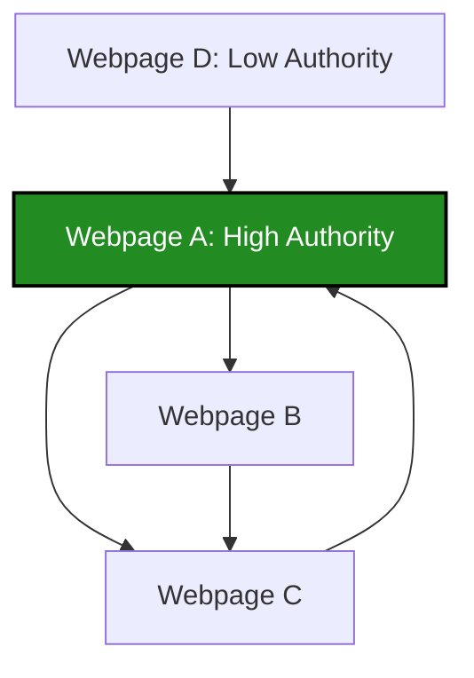

# Data Representation: Topologies, Matrices, and Graph Structures

> [!NOTE]
> In computational systems, the physical reality of an event (a user clicking a webpage, reading a news article, or buying groceries) cannot be processed natively. Data representation is the architectural step of mapping high-entropy physical events into mathematically tractable topologies. The choice of topology strictly governs which machine learning algorithms and statistical operations can be applied.

## 1. Concept Introduction

Data topology refers to the structural arrangement of data points. While relational (tabular) data is the most common paradigm, complex machine learning systems (like Google Search or Amazon Recommendations) rely heavily on non-tabular structures.

We categorize data representations into three fundamental structural classes:
1.  **Record Data:** Instances are standalone entities with a fixed set of attributes (e.g., Relational Tables, Text Documents, Transactions).
2.  **Graphical Data:** Instances are defined by their relationships and connections (e.g., Social Networks, Web hyperlink structures).
3.  **Ordered Data:** Instances exist in a strict sequence where the positional order contains the core signal (e.g., Time-Series, Genomic DNA sequences).

## 2. Record Data: The Foundational Paradigm

Record data represents collections of objects where each object consists of a discrete set of attributes. It is mathematically formalized as a multi-dimensional feature space. Record data bifurcates into three primary types based on the nature of the attributes.

### 2.1 The Data Matrix
When every object possesses the exact same fixed set of continuous or discrete numerical attributes, the data can be visualized as points in an $N$-dimensional space. 

**Mathematical Formulation:**
A dataset with $M$ objects (rows) and $N$ attributes (columns) forms a design matrix $X \in \mathbb{R}^{M \times N}$:

$$
X = \begin{bmatrix}
x_{11} & x_{12} & \dots & x_{1N} \\
x_{21} & x_{22} & \dots & x_{2N} \\
\vdots & \vdots & \ddots & \vdots \\
x_{M1} & x_{M2} & \dots & x_{MN}
\end{bmatrix}
$$

> [!IMPORTANT]
> The defining property of a Data Matrix is that spatial operations (like Euclidean Distance or Cosine Similarity) are mathematically valid across its rows. This enables clustering (K-Means) and distance-based classification (KNN).

### 2.2 Document Data (The Term-Document Matrix)
Text cannot be directly modeled. In Natural Language Processing (NLP), a corpus of documents (e.g., thousands of Google News articles) is converted into a **Term-Document Matrix** using the Bag-of-Words (BoW) model.

*   **Objects (Rows):** The distinct documents.
*   **Attributes (Columns):** The unique vocabulary words across the entire corpus.
*   **Values:** The frequency of the word in that specific document (Term Frequency).

**Term Frequency-Inverse Document Frequency (TF-IDF):**
To prevent common words (like "the", "and") from dominating the matrix, we scale the frequency by the inverse of how many documents contain the word:

$$
\text{TF-IDF}(t, d, D) = f_{t,d} \times \log\left(\frac{|D|}{|\{d \in D : t \in d\}|}\right)
$$
Where:
*   $f_{t,d}$ = Frequency of term $t$ in document $d$
*   $|D|$ = Total number of documents

### Python Implementation: News Document Matrix Simulation

This block demonstrates how unstructured text is transformed into a mathematical Term-Document Matrix suitable for clustering.

```python
import pandas as pd
from sklearn.feature_extraction.text import CountVectorizer, TfidfVectorizer
from sklearn.metrics.pairwise import cosine_similarity

# 1. Raw Data: Unstructured News Documents
news_corpus = [
    "The cricket team won the world cup match.",          # Sports
    "The football coach praised the team defense.",       # Sports
    "The stock market crashed due to high inflation.",    # Finance
    "Inflation rates are affecting the global market."    # Finance
]

# 2. Convert to Term-Document Matrix (Bag of Words)
vectorizer = CountVectorizer(stop_words='english')
term_doc_matrix = vectorizer.fit_transform(news_corpus)

# 3. Create a structured Pandas DataFrame
df_term_doc = pd.DataFrame(
    term_doc_matrix.toarray(), 
    columns=vectorizer.get_feature_names_out(),
    index=['Doc1_Sports', 'Doc2_Sports', 'Doc3_Finance', 'Doc4_Finance']
)

print("Term-Document Matrix (Raw Frequencies):")
print(df_term_doc)
print("\n")

# 4. Measuring Similarity (Applying Math to the Matrix)
# How similar is Doc1 to Doc2 vs Doc3?
# We use Cosine Similarity for sparse text vectors
tfidf_vectorizer = TfidfVectorizer(stop_words='english')
tfidf_matrix = tfidf_vectorizer.fit_transform(news_corpus)

similarity_matrix = cosine_similarity(tfidf_matrix)
print("Cosine Similarity Matrix between Documents:")
print(pd.DataFrame(
    similarity_matrix, 
    index=['Doc1', 'Doc2', 'Doc3', 'Doc4'], 
    columns=['Doc1', 'Doc2', 'Doc3', 'Doc4']
).round(2))

# Expected Output Interpretation:
# Doc1 and Doc2 will have high similarity (~0.14+).
# Doc1 and Doc3 will have 0.0 similarity (orthogonal vectors).
```

### 2.3 Transactional Data
Used heavily in e-commerce and retail (e.g., DMart, Amazon). Unlike a data matrix where every attribute is present, transactional data consists of variable-length lists of items purchased together.

**Mathematical Formulation:**
Let $I = \{i_1, i_2, \dots, i_k\}$ be the set of all inventory items. A transaction $T$ is a subset $T \subseteq I$.

Transactional data is typically converted into a heavily sparse binary matrix where rows are transactions and columns are inventory items ($1$ if purchased, $0$ otherwise). This representation is foundational for **Association Rule Mining** (Apriori algorithm).

## 3. Graphical Data: Networks and Topologies

When the *relationship* between objects is more important than the objects themselves, we use Graphical Data structures. 

### Real-World Analogy: Google PageRank
In the year 2000, analyzing web pages purely as Document Data (text frequency) was failing because search engines were easily manipulated by keyword stuffing. Google revolutionized search by treating the internet as a **Directed Graph**:
*   **Nodes ($V$):** Web pages.
*   **Edges ($E$):** Hyperlinks connecting pages.

### Mathematical Formulation: Adjacency and PageRank
A graph $G = (V, E)$ is computationally represented as an Adjacency Matrix $A$, where $A_{ij} = 1$ if a link exists from page $i$ to page $j$, and $0$ otherwise.

The original PageRank algorithm models a "random surfer" navigating the web. The importance (Rank) of a page $i$ is defined recursively:

$$
PR(i) = \frac{1-d}{N} + d \sum_{j \in M(i)} \frac{PR(j)}{L(j)}
$$

Where:
*   $PR(i)$: PageRank of page $i$.
*   $d$: Damping factor (usually 0.85, probability the surfer continues clicking).
*   $M(i)$: The set of pages that link to page $i$.
*   $L(j)$: The number of outbound links on page $j$.
*   $N$: Total number of pages.

### Visual Intuition: Directed Web Graph


*Notice how A receives links from D and C, making it a central node. In PageRank, a link from a highly-ranked node (like A) passes more "voting power" to B and C.*

### Python Implementation: Simulating PageRank on Graphical Data

```python
import networkx as nx
import matplotlib.pyplot as plt

# 1. Initialize a Directed Graph
G = nx.DiGraph()

# 2. Add edges (hyperlinks) between webpages
edges = [
    ('Page_A', 'Page_B'),
    ('Page_A', 'Page_C'),
    ('Page_D', 'Page_A'),
    ('Page_B', 'Page_C'),
    ('Page_C', 'Page_A')  # C links back to A, creating a reinforcing loop
]
G.add_edges_from(edges)

# 3. Compute the PageRank mathematically (solving the eigenvector problem)
pagerank_scores = nx.pagerank(G, alpha=0.85)

print("PageRank Scores (Importance of each node):")
for page, score in sorted(pagerank_scores.items(), key=lambda x: x[1], reverse=True):
    print(f"{page}: {score:.4f}")

# 4. Optional: View the Adjacency Matrix
adj_matrix = nx.to_numpy_array(G)
print("\nAdjacency Matrix (Rows=From, Cols=To):")
print(adj_matrix)
```

## 4. Ordered Data: Sequence and Temporal Dynamics

In Ordered Data, the physical arrangement of the objects carries critical signal. Shuffling the rows destroys the dataset.

1.  **Time-Series Data:** Attributes are sampled at uniform time intervals. Mathematically, $x_t$ is highly correlated with $x_{t-1}$. This violates the core machine learning assumption that data points are Independent and Identically Distributed (I.I.D.). Standard algorithms fail here; one must use Autoregressive models (ARIMA) or recurrent architectures (LSTMs).
2.  **Genomic Sequences:** Sequences of nucleotides (A, C, G, T). There are no numerical values, only ordered strings. Algorithms here rely on string edit distances (Levenshtein distance) and Hidden Markov Models (HMMs) rather than Euclidean geometry.

## 5. Performance and Systems Engineering Insights

### Computational Tradeoffs: Sparsity
Document Data and Transactional Data result in matrices that are $>99\%$ sparse (most cells are 0). 
*   **The Mistake:** Loading a $1,000,000 \times 1,000,000$ Term-Document matrix into standard memory (RAM) as a dense matrix requires ~4 Terabytes of RAM.
*   **The Engineering Solution:** You must use **Compressed Sparse Row (CSR)** matrices. CSR only stores the non-zero values and their coordinate indices. Scikit-learn's `CountVectorizer` outputs CSR matrices by default to prevent catastrophic Out-Of-Memory (OOM) failures.

### Graph Databases
Relational databases (SQL) are terrible at processing Graphical Data. Querying "Friends of Friends of Friends" requires massive `JOIN` operations that scale exponentially in time $O(N^3)$.
*   **The Engineering Solution:** Use native Graph Databases (like Neo4j) which store pointers directly on the nodes, turning multi-hop network traversals into $O(1)$ pointer lookups.

## 6. Final Takeaways & Interview Preparation

### Key Mental Models
*   **Data Matrix:** Think in *coordinate geometry*. Objects are dots in an $N$-dimensional room.
*   **Document/Transactional Data:** Think in *sparse sets*. Objects are shopping carts filled with a tiny fraction of total available inventory.
*   **Graphical Data:** Think in *webs and votes*. Objects are entities, and edges act as votes of confidence or paths of traversal.
*   **Ordered Data:** Think in *time streams*. The past causally dictates the future.

### High-Frequency Interview Questions
1.  *Why is Euclidean distance a poor metric for Document Data (Term-Document Matrices)?*
    *   **Answer:** Euclidean distance measures absolute magnitude. Two documents might have the exact same topic, but if one is a 50-page essay and the other is a 1-page summary, their Euclidean distance will be massive due to term frequency magnitudes. Cosine similarity solves this by only measuring the *angle* between the vectors, ignoring their absolute length.
2.  *What is the fundamental difference between Transactional Data and a Data Matrix?*
    *   **Answer:** A Data Matrix assumes every record has a fixed, known set of dimensions (e.g., Age, Height, Weight). Transactional data is variable-length (one user buys 1 item, another buys 50). To convert transactional data to a Data Matrix, you must One-Hot Encode the entire inventory, creating extreme sparsity.
3.  *In Graph algorithms like PageRank, what is a "sink node" (or dangling node), and how does the algorithm handle it?*
    *   **Answer:** A sink node has inbound links but zero outbound links. In the matrix representation, this causes the Rank (probability) to leak out of the system, eventually driving all scores to zero. This is fixed mathematically by adding a teleportation matrix (the damping factor $d$), ensuring the random surfer can randomly jump to any other page even if no link exists.