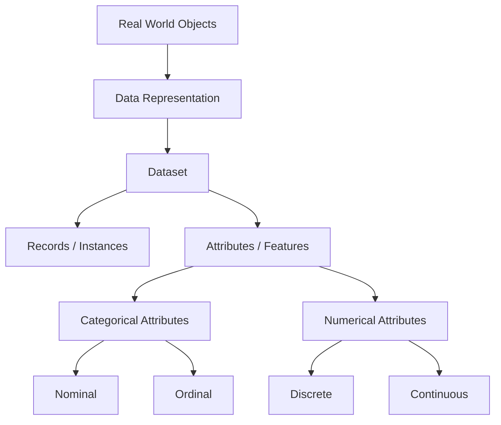

# Lesson 1: Introduction to Datasets and Data Representation

## Overview

Data is the foundation of Data Science, Machine Learning, and Artificial Intelligence. Before performing any analysis or building predictive models, it is essential to understand how data is organized, represented, and described.

This lesson introduces the fundamental concepts related to datasets, data representation, and attribute types. These concepts form the basis for all subsequent topics in data preprocessing, exploratory data analysis, machine learning, and statistical modeling.

A clear understanding of datasets and attributes enables data scientists to choose appropriate preprocessing techniques, analytical methods, and machine learning algorithms.

## Learning Objectives

After completing this lesson, you should be able to:

- Define what a dataset is and identify its major components.
- Understand how real-world information is represented as data.
- Explain different forms of data representation.
- Identify various attribute types found in datasets.
- Distinguish between categorical and numerical data.
- Recognize the importance of proper data representation in analytical tasks.
- Select suitable analytical techniques based on attribute types.

## Topics Covered

### 1. [What is the Dataset](What%20is%20the%20Dataset.md)

A dataset is a structured collection of related data items organized for analysis and decision making.

This topic introduces:

- Definition of a dataset
- Rows (instances, records, observations)
- Columns (features, variables, attributes)
- Dataset structure
- Examples of real-world datasets
- Dataset dimensions

Typical examples include:

- Student performance datasets
- Healthcare records
- Sales transactions
- Customer databases
- Sensor measurements

Understanding datasets is the first step toward effective data analysis.

### 2. [Data Representation](Data%20Representation.md)

Real-world entities must be converted into a structured format before they can be analyzed computationally.

This section explores:

- How data is represented in tabular form
- Objects and attributes
- Feature vectors
- Data matrices
- Transactional representation
- Sparse and dense representations

Different forms of representation influence:

- Storage requirements
- Computational efficiency
- Analytical techniques
- Machine learning performance

Proper data representation is critical for extracting meaningful insights from data.

### 3. [Attributes & Their Types](Attributes%20%26%20Their%20Types.md)

Attributes describe the characteristics or properties of objects within a dataset.

This topic covers the major attribute categories used in Data Science:

#### Categorical Attributes

- Nominal Attributes
- Binary Attributes
- Ordinal Attributes

#### Numerical Attributes

- Interval Attributes
- Ratio Attributes
- Discrete Attributes
- Continuous Attributes

Understanding attribute types is essential because different statistical methods and machine learning algorithms require different data types.

For example:

- Mean can be calculated for numerical data but not nominal data.
- Classification algorithms often require categorical target variables.
- Distance-based algorithms depend heavily on attribute types.

## Conceptual Relationship

## Lesson Navigation

| Topic | Description |
|--------|-------------|
| [What is the Dataset](What%20is%20the%20Dataset.md) | Introduction to datasets and their components |
| [Data Representation](Data%20Representation.md) | Learn how real-world entities are represented as structured data |
| [Attributes & Their Types](Attributes%20%26%20Their%20Types.md) | Explore various attribute types used in Data Science |

## Key Takeaways

- A dataset is a structured collection of observations organized for analysis.
- Data representation determines how information is stored and processed.
- Attributes describe the characteristics of objects within a dataset.
- Attributes can be broadly classified as categorical or numerical.
- The choice of analytical methods often depends on attribute types.
- Understanding data structure is fundamental to successful data preprocessing and machine learning.

## Prerequisites for Future Topics

The concepts covered in this lesson provide the foundation for:

- Data Preprocessing
- Data Cleaning
- Exploratory Data Analysis (EDA)
- Feature Engineering
- Statistical Analysis
- Machine Learning
- Data Mining
