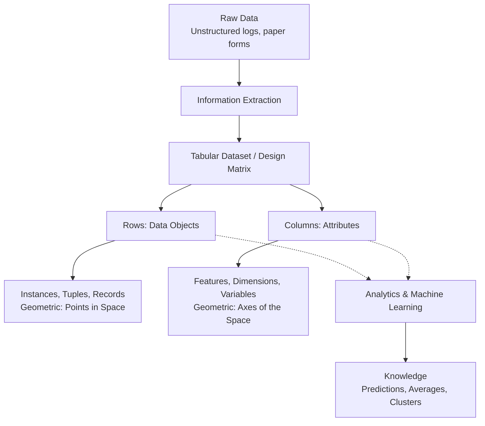

## Datasets, Data Objects, and Attributes

> [!NOTE]
> In applied machine learning and data engineering, a dataset is not merely a spreadsheet; it is a mathematical structure that maps real-world phenomena into a computable, high-dimensional geometric space. Understanding the exact anatomy of a dataset is the foundational step before any data preprocessing, mining, or modeling can occur.

## 1. Concept Introduction

At the highest level of abstraction, a **Dataset** is a structured collection of **Data Objects** defined by a specific set of **Attributes**.

To bridge the gap between raw entropy and actionable machine learning, we must formally define these components:
1.  **Data Object:** The fundamental entity being observed. Synonyms include *row, record, tuple, point, instance, sample, case, or entity*.
2.  **Attribute:** A measurable property, characteristic, or trait of the data object. Synonyms include *column, feature, dimension, variable, or field*.

## 2. Intuition and The Information Transition

To understand why datasets are structured this way, we must look at the epistemological transition of data. 

*   **Data (Raw):** High-entropy, unstructured signals (e.g., a hand-written student enrollment form).
*   **Information (Structured Dataset):** Data organized into a formal schema (e.g., transforming the form into a tabular row with specific columns for ID, Name, and Age).
*   **Knowledge (Insights):** Applying statistical or computational queries to the information (e.g., calculating the average age of all enrolled Computer Science students).

## 3. Mathematical Framework: The Design Matrix

In machine learning and statistics, a tabular dataset is formalized as a **Design Matrix** $X$. 

Let a dataset contain $n$ data objects, where each object is described by $d$ attributes. The dataset is represented as a matrix $X \in \mathbb{R}^{n \times d}$:

$$
X = \begin{bmatrix}
x_{11} & x_{12} & \dots & x_{1d} \\
x_{21} & x_{22} & \dots & x_{2d} \\
\vdots & \vdots & \ddots & \vdots \\
x_{n1} & x_{n2} & \dots & x_{nd}
\end{bmatrix}
$$

### Extracting Objects (Rows)
A single **Data Object** is a row vector in this matrix, representing a single point in a $d$-dimensional feature space:

$$
x_i = [x_{i1}, x_{i2}, \dots, x_{id}]
$$

### Extracting Attributes (Columns)
A single **Attribute** is a column vector, representing the distribution of a single feature across all $n$ objects:

$$
x^{(j)} = \begin{bmatrix} x_{1j} \\ x_{2j} \\ \vdots \\ x_{nj} \end{bmatrix}
$$

> [!IMPORTANT]
> The geometric interpretation is critical. If your dataset has 3 attributes (e.g., Age, Income, Credit Score), every data object is a coordinate $(x, y, z)$ in a 3-dimensional Euclidean space. Machine learning algorithms operate by calculating distances and drawing boundaries within this specific space.

## 4. Visualizing the Dataset Architecture



## 5. Alternative Data Sources & Structures

While the tabular format (relational databases, CSVs) is dominant, data engineering deals with multiple data topologies:

1.  **Data Streams:** Unbounded, continuous flows of bits (e.g., telecom audio parsing, IoT sensor networks). Handled via systems like Apache Kafka.
2.  **Time-Series Data:** Objects containing a strict temporal dimension (e.g., predicting gold prices $P_t$ given $P_{t-1}, P_{t-2}$).
3.  **Spatiotemporal Data:** Data encompassing both time and geographic coordinates (e.g., Uber tracking an object moving through latitude/longitude over time).
4.  **Graphical / Network Data:** Objects are nodes, and relationships are edges (e.g., Google's PageRank analyzing the web graph).

## 6. Python Implementation: Simulating and Dissecting a Dataset

The following implementation bridges the mathematical theory of the design matrix with practical `pandas` and `numpy` engineering.

```python
import pandas as pd
import numpy as np

## 1. Simulating Raw Data Entry (Information gathering)
raw_data = {
    'Transaction_ID': ['TXN_001', 'TXN_002', 'TXN_003', 'TXN_004'],
    'Date': ['2023-06-01', '2023-06-02', '2023-06-02', '2023-06-03'],
    'Amount_USD': [150.50, 25.00, 3000.00, 45.75],
    'Type': ['Debit', 'Debit', 'Credit', 'Debit'],
    'Is_Fraud': [0, 0, 1, 0]
}

## 2. Creating the Structured Dataset
df = pd.DataFrame(raw_data)
df.set_index('Transaction_ID', inplace=True)

print("Full Dataset (Design Matrix):")
print(df)
print("\n" + "="*40 + "\n")

## 3. Extracting a Data Object (Row Vector / Instance)
## We use .loc to extract the tuple representing TXN_003
object_txn3 = df.loc['TXN_003']
print(f"Data Object (Tuple) for TXN_003:\n{object_txn3}\n")
print(f"Geometric representation (Vector): {object_txn3.values}")
print("\n" + "="*40 + "\n")

## 4. Extracting an Attribute (Column Vector / Dimension)
## We extract the 'Amount_USD' dimension
attribute_amount = df['Amount_USD']
print(f"Attribute (Dimension) for Amount_USD:\n{attribute_amount}\n")

## 5. Extracting Knowledge (Analytics on Attributes)
average_amount = attribute_amount.mean()
fraud_count = df['Is_Fraud'].sum()
print(f"Extracted Knowledge: Average transaction is ${average_amount:.2f}")
print(f"Extracted Knowledge: Total fraudulent objects found: {fraud_count}")
```

> [!TIP]
> **Expected Output Insight:** Notice how extracting an object (row) yields a vector of mixed data types (float, string, integer), whereas extracting an attribute (column) yields a vector of a strictly single mathematical type. This homogeneity in columns is why vectorized operations in NumPy/Pandas are immensely fast.

## 7. Performance and Computational Insights

### Row-Major vs. Column-Major Storage
Understanding objects vs. attributes dictates how you store data in production systems.

*   **OLTP (Online Transaction Processing):** Systems like PostgreSQL store data **row by row** (Object-oriented storage). This is optimized for writing new data points (e.g., inserting a new user registration instantly).
*   **OLAP (Online Analytical Processing):** Systems like Snowflake or file formats like Apache Parquet store data **column by column** (Attribute-oriented storage). If you only need to calculate the average of the `Amount_USD` attribute across 10 billion objects, columnar storage allows you to load *only* that specific dimension into RAM, avoiding I/O bottlenecking on irrelevant attributes.

## 8. Common Engineering Mistakes

*   **The Curse of Dimensionality:** In a rush to capture every possible characteristic, engineers often add too many attributes (columns). Mathematically, as dimensions $d$ increase, the volume of the feature space grows exponentially, making all data objects appear uniformly far apart, destroying the functionality of clustering and distance-based machine learning.
*   **Assuming Attribute Homogeneity:** Treating categorical attributes (like "Major = CS") the same as continuous attributes (like "Age = 25") in distance calculations. A distance of `25 - 20 = 5` in age makes mathematical sense. A distance of `CS - EE` does not. 

## 9. Final Takeaways & Interview Preparation

### Mental Models
*   **The Object:** Think of the object as the *noun* in your dataset (The Student, The Transaction, The Patient).
*   **The Attribute:** Think of the attribute as the *adjective* describing the noun (Age 21, High-Risk, Diabetic).

### Interview Questions
1.  *In the context of the design matrix, what happens if $n < d$ (fewer objects than attributes)?*
    *   **Answer:** The system becomes mathematically underdetermined. In regression, this means the matrix $X^T X$ is not invertible (singular), and a unique mathematical solution does not exist without applying regularization (like Ridge or Lasso) or dimensionality reduction.
2.  *What is the difference between a time-series dataset and a standard tabular dataset?*
    *   **Answer:** A standard tabular dataset assumes that data objects are Independent and Identically Distributed (i.i.d.). A time-series dataset inherently violates the independence assumption because object $x_t$ is causally correlated with object $x_{t-1}$.

### Advanced Learning Roadmap
*   **Data Types and Measurement Scales:** Explore Nominal, Ordinal, Interval, and Ratio attribute types, as they strictly govern which mathematical operations are permissible on a given column.
*   **Tensors:** Understand how a 2D tabular dataset scales into higher dimensions (e.g., a color image is a 3D tensor of height $\times$ width $\times$ RGB channels).

Tags: #statistics #machine-learning #data-science #statistical-modelling
