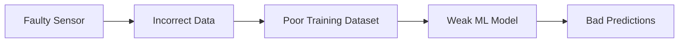

# 3.1 Accuracy

Accuracy refers to whether the collected data correctly represents real-world conditions.

A weather prediction system provides a strong example. To predict whether it will rain tomorrow, multiple environmental parameters must be measured:

|Parameter|Example|
|---|---|
|Temperature|32°C|
|Humidity|78%|
|Wind Speed|14 km/h|
|Wind Direction|South-West|
|Rainfall|12 mm|

If the sensors collecting these values malfunction, the resulting dataset becomes inaccurate.

An inaccurate temperature sensor creates:

$$
T_{measured} \neq T_{actual}
$$

Once inaccurate values enter the pipeline, downstream predictions also degrade.

This creates a cascading failure:

