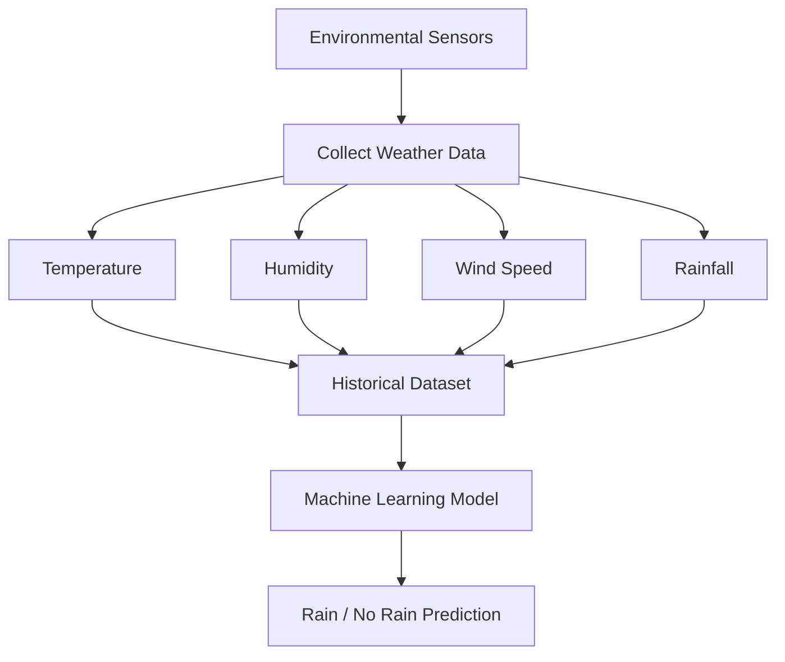

# Weather Prediction System Example

The lecture repeatedly uses weather prediction because it naturally demonstrates nearly every data quality dimension simultaneously.

The complete workflow looks like this:

This example demonstrates:

|Data Quality Dimension|Weather Example|
|---|---|
|Accuracy|Correct sensor readings|
|Completeness|Enough years of weather data|
|Consistency|Uniform temperature units|
|Timeliness|Frequent measurements|
|Believability|Trusted meteorological sensors|
|Interpretability|Physically meaningful values|
