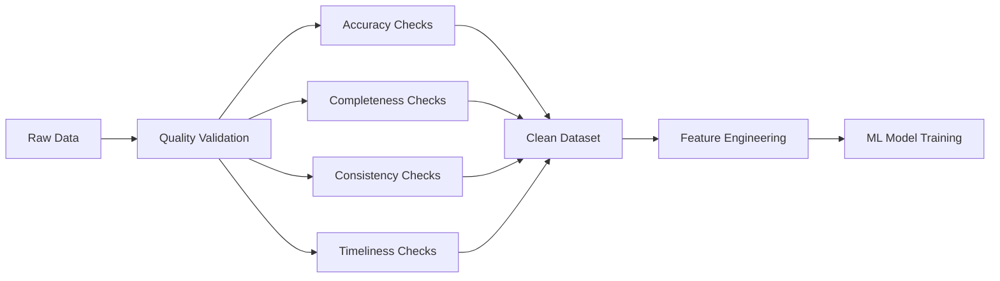

# Data Quality Pipeline

A generalized machine learning preprocessing pipeline:

```mermaid
flowchart LR
    A[Raw Data]
    --> B[Quality Validation]

    B --> C[Accuracy Checks]
    B --> D[Completeness Checks]
    B --> E[Consistency Checks]
    B --> F[Timeliness Checks]

    C --> G[Clean Dataset]
    D --> G
    E --> G
    F --> G

    G --> H[Feature Engineering]
    H --> I[ML Model Training]
```

This preprocessing stage often consumes the majority of real-world machine learning effort.
