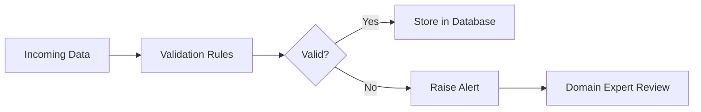

# Automated Validation Pipeline

```mermaid
flowchart LR
    A[Incoming Data]
    --> B[Validation Rules]

    B --> C{Valid?}

    C -->|Yes| D[Store in Database]
    C -->|No| E[Raise Alert]

    E --> F[Domain Expert Review]
```
