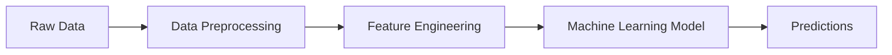
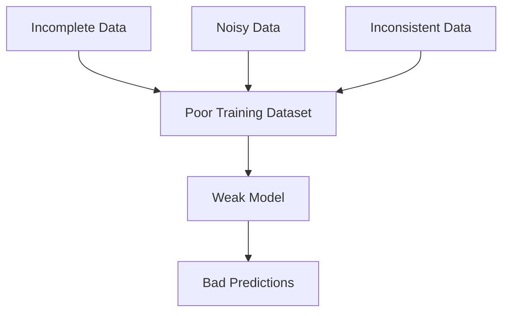

# Impact of Poor Data on Machine Learning

Machine learning models learn patterns directly from the training data.

The simplified workflow looks like this:

If preprocessing fails to detect poor-quality data:

This directly affects:

- Prediction accuracy
    
- Statistical validity
    
- Decision-making quality
    
- Business trust
    
- Automation reliability
