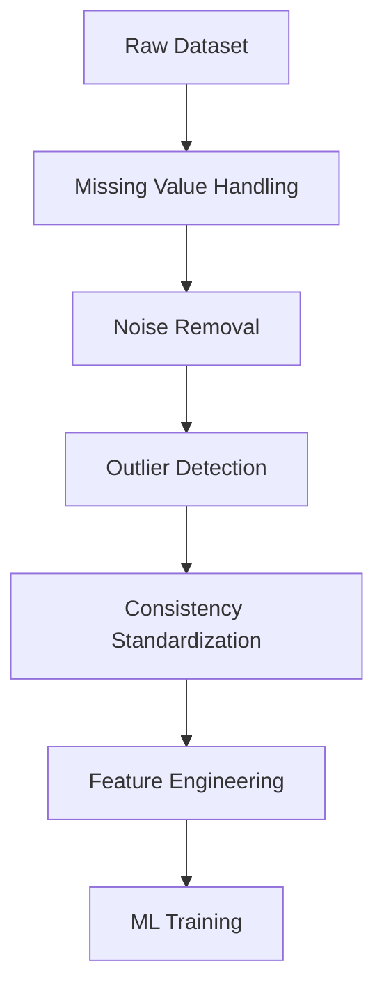

# Data Cleaning and Preprocessing

Before machine learning begins, data preprocessing pipelines typically include:

1. Missing value handling
    
2. Noise reduction
    
3. Outlier analysis
    
4. Format standardization
    
5. Duplicate removal
    
6. Consistency checks
    

A generalized preprocessing architecture:

