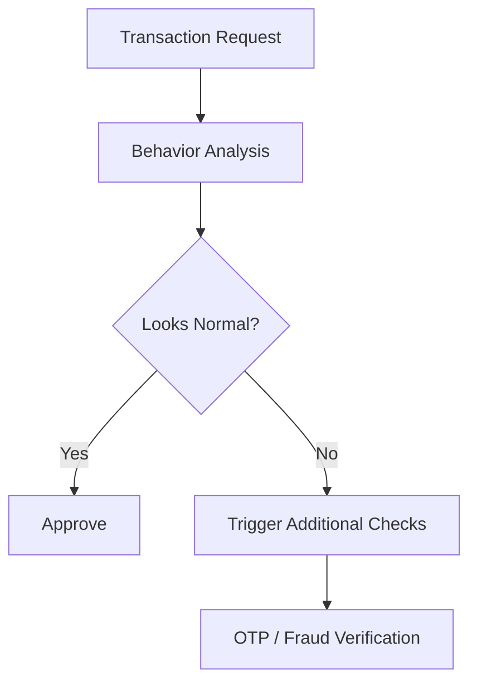

# Credit Card Fraud Detection

Banks continuously analyze transaction patterns.

Most transactions follow normal behavior:

|User|Location|Amount|
|---|---|---|
|Usual Activity|Goa|₹2000|

Suddenly:

|User|Location|Amount|
|---|---|---|
|Suspicious Activity|USA|₹2,00,000|

This transaction becomes an outlier.

The system then triggers additional verification:

- OTP checks
    
- Fraud analysis
    
- Authentication layers
    

