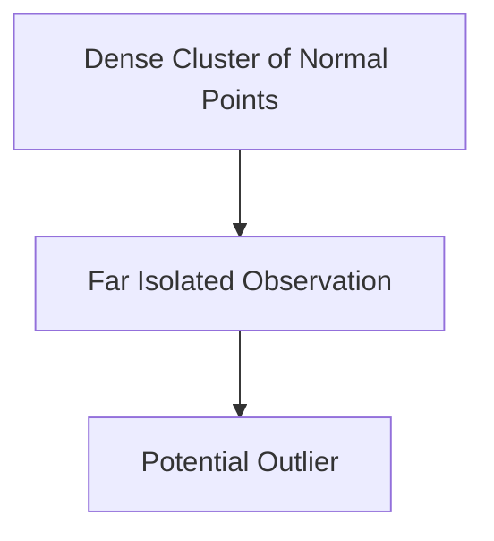

# Visual Understanding of Outliers

The lecture describes outliers using a two-dimensional dataset.

Most observations cluster together while a few isolated points lie far away.

Conceptually:

|Point Type|Position|
|---|---|
|Normal Data|Near cluster center|
|Outlier|Far from cluster|

Outlier detection algorithms attempt to quantify this separation mathematically.
