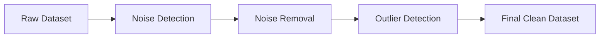

# Order of Handling: Noise Before Outliers

The lecture emphasizes an important preprocessing sequence:

1. Remove noise
    
2. Detect outliers
    

Reason:

Noise itself may appear like an outlier.

If noisy points are not removed first, the system may incorrectly classify corrupted observations as genuine anomalies.

The workflow becomes:

This ordering is extremely important in practical preprocessing pipelines.
