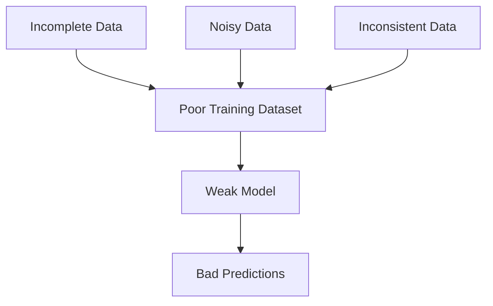
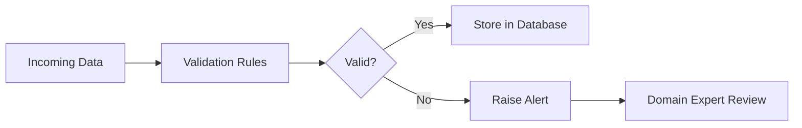
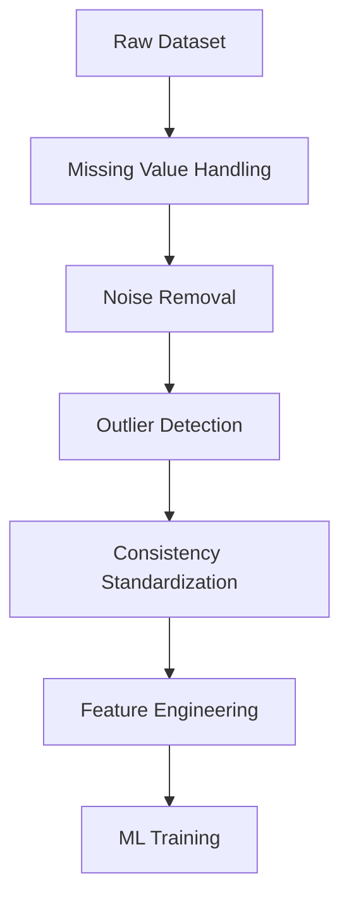

## Examples of Data Quality Issues

Real-world data is rarely clean. Most datasets contain missing fields, contradictory formats, measurement errors, duplicate records, or values that simply do not make sense. In machine learning and data mining, poor-quality data directly reduces model reliability because algorithms fundamentally operate on mathematical relationships between variables. If the underlying data is flawed, the resulting predictions, clusters, classifications, or insights become unreliable.

This idea is commonly summarized using the principle:

> Garbage In → Garbage Out (GIGO)

A machine learning system trained on poor data will produce poor outcomes regardless of how advanced the algorithm is.

## Understanding Data Quality

Data quality refers to how useful, accurate, consistent, and analyzable a dataset is. A dataset with high quality should support reliable processing and meaningful analysis.

Some major dimensions of data quality include:

- Accuracy
    
- Completeness
    
- Consistency
    
- Timeliness
    
- Believability
    
- Interpretability
    

These dimensions determine whether the dataset can realistically support statistical analysis or machine learning workflows.

A simplified conceptual relationship can be expressed as:

$$  
\text{Model Quality} \propto \text{Data Quality}  
$$

If the data quality decreases:

$$  
\text{Prediction Reliability} \downarrow  
$$

## Incomplete Data

Incomplete data refers to missing values within the dataset. Missingness can occur at multiple levels:

- Individual fields may be empty
    
- Entire rows may be absent
    
- Complete columns may not exist
    

A common real-world example is census collection. Government officials may collect demographic information such as:

- Name
    
- Age
    
- Gender
    
- Vehicle ownership
    
- Income
    
- Caste
    
- Number of family members
    

However, individuals may refuse to disclose certain details. This creates missing values within the dataset.

For example:

|House ID|Age|Gender|Income|
|---|---|---|---|
|101|42|Male|900000|
|102|NULL|Female|500000|
|103|29|NULL|NULL|

The NULL entries represent incomplete data.

## Why Missing Values Matter

Machine learning algorithms rely heavily on mathematical operations such as distance calculations, similarity measures, probability estimation, and optimization.

A common similarity computation is Euclidean distance:

d(x,y)=\sqrt{\sum_{i=1}^{n}(x_i-y_i)^2}

If one or more values are missing:

$$  
x_i = \text{NULL}  
$$

then the distance computation becomes invalid or misleading.

This creates major problems in:

- Clustering
    
- K-Nearest Neighbors
    
- Regression
    
- Neural Networks
    
- Statistical inference
    

Most machine learning systems therefore require missing-value handling before training.

## Types of Missingness

Incomplete data and incorrect data are different problems.

### Incomplete Data

The value is absent.

Example:

|Age|
|---|
|NULL|

### Incorrect Data

The value exists but is wrong.

Example:

|Date of Birth|
|---|
|January 2090|

The second case is harder because the system must detect invalidity rather than absence.

## Noisy Data

Noisy data refers to data that has been unintentionally distorted from its original value. Noise modifies the signal and introduces uncertainty into analysis.

Mathematically:

$$  
X_{observed} = X_{true} + \epsilon  
$$

where:

- $X_{true}$ is the actual value
    
- $\epsilon$ is random noise/error
    

## Sources of Noise

Noise commonly originates from:

- Sensor inaccuracies
    
- Transmission errors
    
- Weather interference
    
- Human entry mistakes
    
- Faulty hardware
    
- Communication disturbances
    

A simple example is a humidity sensor with measurement error:

$$  
Humidity_{measured} = Humidity_{actual} \pm \delta  
$$

Another real-world example is distorted audio during poor network connectivity.

## Noise vs Outliers

Noise and outliers are not the same.

|Concept|Meaning|
|---|---|
|Noise|Random corruption of valid data|
|Outlier|Legitimate but unusual observation|

An outlier may represent something genuinely rare.

Example:

|Person|Salary|
|---|---|
|A|5 LPA|
|B|6 LPA|
|C|7 LPA|
|D|2 Crore|

Person D may not be erroneous. They may genuinely belong to a different distribution.

Noise, however, is usually considered undesirable corruption.

## Inconsistent Data

Inconsistent data occurs when different parts of a dataset follow incompatible formats, scales, or conventions.

This usually happens when integrating multiple data sources.

## Unit Inconsistency

Suppose one dataset stores temperature in Celsius while another stores it in Fahrenheit.

|City|Temperature|
|---|---|
|Pune|32°C|
|Dallas|89°F|

Blindly merging these values creates inconsistency.

Temperature conversion formula:

F=\frac{9}{5}C+32

Without standardization, downstream analytics become meaningless.

## Format Inconsistency

Dates may appear in multiple formats:

|Format Type|Example|
|---|---|
|DD-MM-YYYY|31-05-2026|
|YYYY-MM-DD|2026-05-31|

If systems mix formats, parsing errors occur.

## Rating Scale Inconsistency

Different systems may represent the same concept differently.

|Dataset A|Dataset B|
|---|---|
|A|1|
|B|2|
|C|3|

Merging these without mapping creates semantic inconsistency.

## Impact of Poor Data on Machine Learning

Machine learning models learn patterns directly from the training data.

The simplified workflow looks like this:

If preprocessing fails to detect poor-quality data:

This directly affects:

- Prediction accuracy
    
- Statistical validity
    
- Decision-making quality
    
- Business trust
    
- Automation reliability
    

## Detecting Data Quality Issues

There are two broad approaches:

## Manual Detection

Domain experts inspect the dataset and identify anomalies manually.

Example:

- Detecting impossible ages
    
- Identifying suspicious income values
    
- Spotting duplicate records
    

This approach is accurate but expensive and slow.

## Automated Detection

Rule-based systems automatically validate data constraints.

Example validation rule:

$$  
0 \leq Age \leq 120  
$$

If:

$$  
Age = 500  
$$

then:

$$  
\text{Raise Error Flag}  
$$

## Automated Validation Pipeline

## Data Cleaning and Preprocessing

Before machine learning begins, data preprocessing pipelines typically include:

1. Missing value handling
    
2. Noise reduction
    
3. Outlier analysis
    
4. Format standardization
    
5. Duplicate removal
    
6. Consistency checks
    

A generalized preprocessing architecture:

## Key Takeaways

Data quality problems are unavoidable in real-world systems. The three major categories discussed are:

- Incomplete data
    
- Noisy data
    
- Inconsistent data
    

Missing data creates mathematical and computational failures in machine learning pipelines. Noise corrupts valid signals, while inconsistency introduces semantic contradictions across datasets.

Most practical ML engineering effort is not spent building models but cleaning and validating data.

The central principle remains:

$$  
\text{Bad Data} \Rightarrow \text{Bad Model}  
$$

or more famously:

> Garbage In → Garbage Out

Tags: #statistics #machine-learning #data-science #statistical-modelling