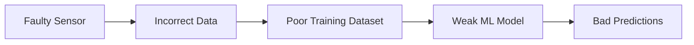
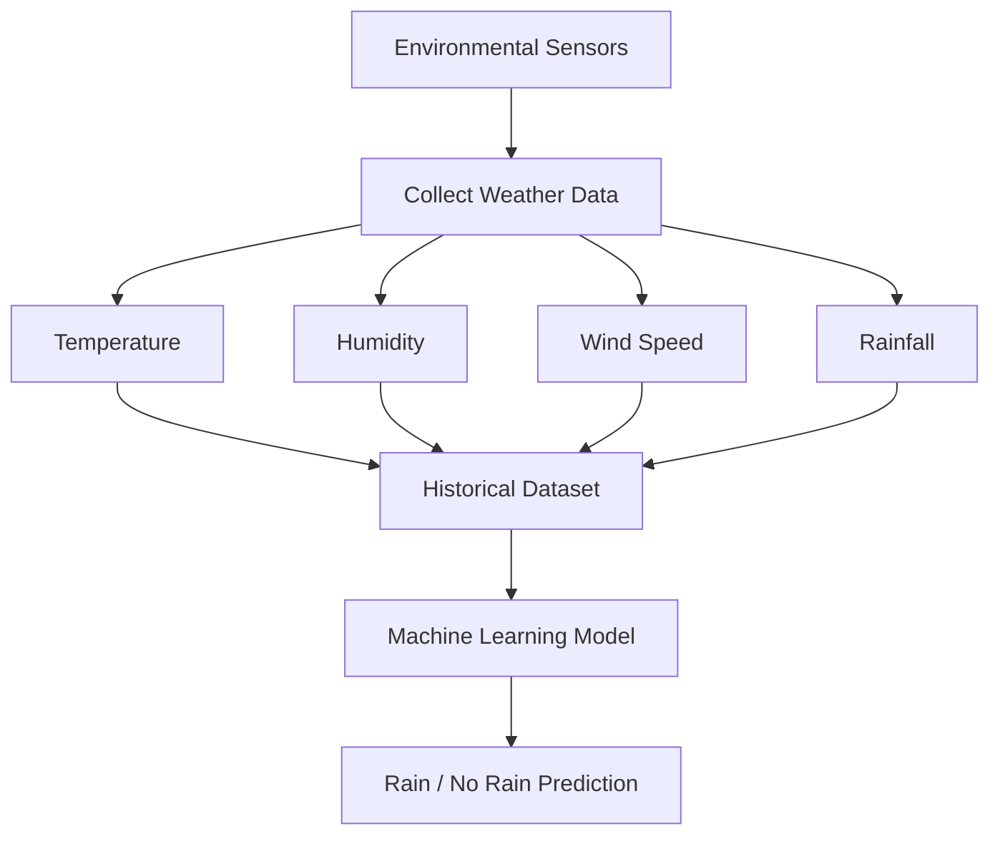
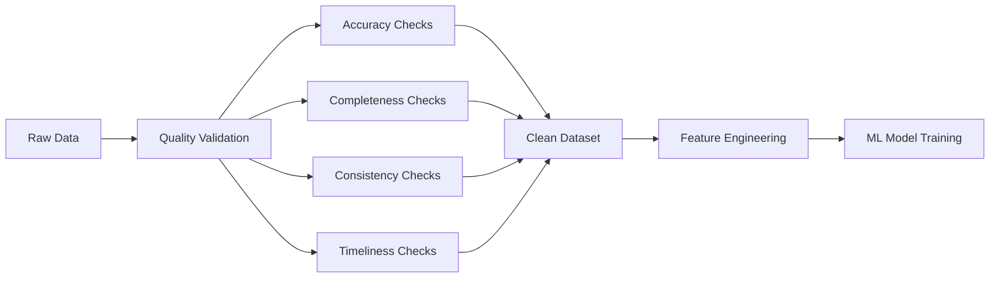

## Index

1. Introduction to Data Quality
    
2. Defining Data Quality
    
3. Dimensions of Data Quality  
    3.1 Accuracy  
    3.2 Completeness  
    3.3 Consistency  
    3.4 Timeliness  
    3.5 Believability  
    3.6 Interpretability
    
4. Weather Prediction System Example
    
5. Why Data Quality Matters in Machine Learning
    
6. Subjective Nature of Data Quality
    
7. Data Quality Pipeline
    
8. Key Takeaways
    

## Introduction to Data Quality

Data preprocessing begins with understanding data quality because machine learning systems are only as reliable as the data they consume. Before any prediction, classification, clustering, or forecasting model is trained, the dataset must be evaluated for correctness, completeness, reliability, and usability.

Data quality determines whether a dataset can realistically support meaningful analysis.

A poor-quality dataset creates unreliable patterns and misleading predictions regardless of how advanced the machine learning algorithm is.

## Defining Data Quality

Data quality refers to the overall utility of a dataset based on how effectively it can be processed and analyzed for a specific purpose.

Formally:

$$  
\text{Data Quality} \propto \text{Utility of Data}  
$$

A dataset has high quality if:

- It supports reliable analysis
    
- It can be processed consistently
    
- It satisfies the intended use case
    
- It minimizes ambiguity and errors
    

The important point here is that data quality is not universal.

A dataset considered “high quality” for one business problem may be completely useless for another.

## Dimensions of Data Quality

Data quality is generally measured using six major dimensions:

|Dimension|Core Question|
|---|---|
|Accuracy|Is the data correct?|
|Completeness|Is sufficient data available?|
|Consistency|Is the format uniform?|
|Timeliness|Is the data recent and updated?|
|Believability|Is the source trustworthy?|
|Interpretability|Can humans understand the data?|

## 3.1 Accuracy

Accuracy refers to whether the collected data correctly represents real-world conditions.

A weather prediction system provides a strong example. To predict whether it will rain tomorrow, multiple environmental parameters must be measured:

|Parameter|Example|
|---|---|
|Temperature|32°C|
|Humidity|78%|
|Wind Speed|14 km/h|
|Wind Direction|South-West|
|Rainfall|12 mm|

If the sensors collecting these values malfunction, the resulting dataset becomes inaccurate.

An inaccurate temperature sensor creates:

$$  
T_{measured} \neq T_{actual}  
$$

Once inaccurate values enter the pipeline, downstream predictions also degrade.

This creates a cascading failure:

## 3.2 Completeness

Completeness refers to whether sufficient information exists to describe the problem properly.

Completeness exists in two dimensions:

|Type|Meaning|
|---|---|
|Row Completeness|Enough observations exist|
|Column Completeness|Enough attributes/features exist|

### Row Completeness

A weather prediction system trained on only 10 days of data will perform poorly because seasonal weather patterns require historical information.

Mathematically:

$$  
\text{Prediction Quality} \uparrow \text{ as Historical Coverage} \uparrow  
$$

Weather systems often use decades of historical data because atmospheric patterns evolve slowly over time.

### Column Completeness

Even if sufficient rows exist, important attributes may still be missing.

For example:

|Temperature|Humidity|Wind Speed|Rain Tomorrow|
|---|---|---|---|
|31°C|Missing|10 km/h|Yes|

Humidity may be essential for rainfall prediction. Missing that attribute weakens model performance.

## 3.3 Consistency

Consistency means the dataset follows uniform standards throughout.

A major example is unit consistency.

Suppose one weather station measures temperature in Celsius while another uses Fahrenheit:

|Station|Temperature|
|---|---|
|Goa Station A|30°C|
|Goa Station B|86°F|

If merged directly, the dataset becomes inconsistent.

Temperature conversion formula:

F=\frac{9}{5}C+32

Consistency problems commonly appear during multi-source data integration.

Examples include:

|Data Type|Inconsistent Formats|
|---|---|
|Temperature|Celsius vs Fahrenheit|
|Date|DD-MM-YYYY vs YYYY-MM-DD|
|Currency|INR vs USD|
|Speed|km/h vs knots|

Machine learning models assume uniform semantics. Inconsistent data breaks those assumptions.

## 3.4 Timeliness

Timeliness refers to whether the data is recent and updated frequently enough for the task.

Certain systems depend heavily on temporal continuity.

Examples:

|Application|Why Timeliness Matters|
|---|---|
|Weather Prediction|Yesterday influences today|
|Stock Trading|Millisecond delays matter|
|News Recommendation|Old news loses value|
|Fraud Detection|Delayed detection increases risk|

In weather prediction:

$$  
Weather_t \approx f(Weather_{t-1}, Weather_{t-2}, ...)  
$$

Recent observations strongly influence future predictions.

Timeliness also includes collection frequency.

For example, measuring temperature once daily may be insufficient. Measuring it every hour captures richer environmental dynamics.

## 3.5 Believability

Believability refers to whether the data originates from trusted and credible sources.

A dataset gathered from official meteorological departments is generally more reliable than data from unknown internet sources.

Believability depends on:

|Factor|Meaning|
|---|---|
|Source Credibility|Trusted organization|
|Sensor Reliability|Verified hardware|
|Data Collection Standards|Scientific measurement procedures|
|Auditability|Ability to trace origin|

Low-believability data introduces uncertainty even if the values appear correct.

## 3.6 Interpretability

Interpretability means humans should be able to understand the meaning and validity of the data.

Example:

|Temperature|
|---|
|70°C|

For most regions on Earth, 70°C is highly improbable.

Similarly:

|Temperature|
|---|
|-70°C in India|

This is likely invalid.

Interpretability acts as a human sanity-check layer over automated systems.

A useful mental model:

$$  
\text{Interpretability} = \text{Human Understandability of Data}  
$$

## Weather Prediction System Example

The lecture repeatedly uses weather prediction because it naturally demonstrates nearly every data quality dimension simultaneously.

The complete workflow looks like this:

This example demonstrates:

|Data Quality Dimension|Weather Example|
|---|---|
|Accuracy|Correct sensor readings|
|Completeness|Enough years of weather data|
|Consistency|Uniform temperature units|
|Timeliness|Frequent measurements|
|Believability|Trusted meteorological sensors|
|Interpretability|Physically meaningful values|

## Why Data Quality Matters in Machine Learning

Machine learning models learn statistical relationships from historical data.

Simplified representation:

$$  
Model = f(Data)  
$$

Therefore:

$$  
Bad\ Data \Rightarrow Bad\ Model  
$$

This is the foundation of the famous principle:

> Garbage In → Garbage Out

If the dataset contains:

- Missing values
    
- Incorrect measurements
    
- Inconsistent formats
    
- Delayed updates
    
- Untrustworthy sources
    

then the resulting predictions become unreliable.

## Subjective Nature of Data Quality

One of the most important insights is that data quality is subjective.

The same dataset may be useful for one department and useless for another.

Example:

|User|Expected Insights|
|---|---|
|Delivery Manager|Delivery delays, logistics efficiency|
|R&D Manager|Product innovation patterns|

A dataset optimized for logistics may lack innovation-related variables.

Therefore:

$$  
\text{Data Quality depends on Intended Use}  
$$

This is why the lecture defines quality as:

> Data satisfies the requirement of the intended user.

## Data Quality Pipeline

A generalized machine learning preprocessing pipeline:

This preprocessing stage often consumes the majority of real-world machine learning effort.

## Key Takeaways

Data quality is foundational to machine learning, analytics, and data mining systems.

The six core dimensions are:

|Dimension|
|---|
|Accuracy|
|Completeness|
|Consistency|
|Timeliness|
|Believability|
|Interpretability|

The lecture’s central argument is simple:

$$  
\text{High Quality Data} \Rightarrow \text{Reliable Predictions}  
$$

while:

$$  
\text{Poor Quality Data} \Rightarrow \text{Misleading Outcomes}  
$$

The most important practical insight is that data quality is context-dependent. A dataset is only “good” if it supports the intended analytical objective.

Tags: #statistics #machine-learning #data-science #statistical-modelling