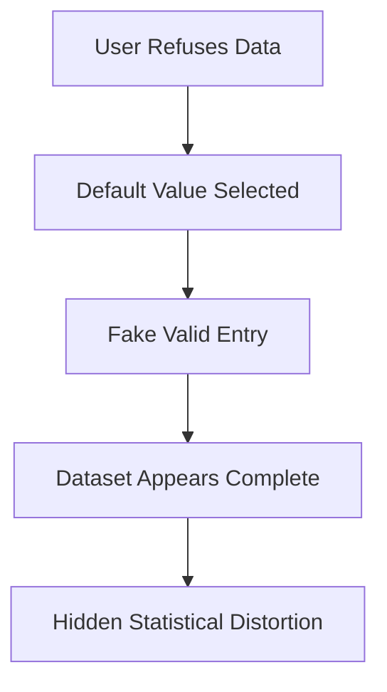
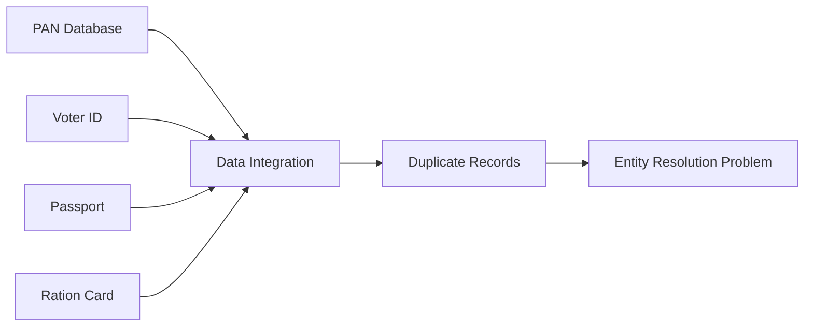

# Index

1. Introduction to Missing Values
    
2. Real-World Nature of Missing Data
    
3. Causes of Missing Values
    
4. Disguised Missing Values
    
5. Why Disguised Missing Data is Dangerous
    
6. Handling Missing Values
    
7. Understanding Duplicate Data
    
8. Causes of Duplicate Data
    
9. Aadhaar Case Study and Data Integration
    
10. Entity Identification Problem
    
11. Detecting Duplicate Records
    
12. Missing Data vs Duplicate Data
    
13. Key Takeaways
    

# Introduction to Missing Values

Missing values occur when information that should exist in a dataset is absent. A field may be empty because the information was never collected, the user refused to provide it, the sensor failed, or the value was deleted accidentally.

Real-world datasets are almost never complete. Data preprocessing therefore becomes a critical stage in machine learning because algorithms generally assume structured and available information.

A missing value can be represented as:

$$  
x_i = NULL  
$$

or:

$$  
x_i = NA  
$$

Missingness creates uncertainty because the algorithm no longer has a complete representation of the observation.

# Real-World Nature of Missing Data

A common misconception is that machine learning mainly involves downloading datasets from platforms like Kaggle and training models immediately.

In reality, real-world systems require:

|Stage|Description|
|---|---|
|Attribute Identification|Deciding what to collect|
|Data Collection|Sensors, forms, APIs, surveys|
|Data Storage|Structuring into databases|
|Data Cleaning|Removing inconsistencies|
|Data Preprocessing|Handling errors and gaps|
|ML Modeling|Applying algorithms|

The difficult part is usually not model training. It is collecting usable data.

During collection, missing values naturally emerge because real systems are imperfect.

# Causes of Missing Values

Missing values arise for several practical reasons.

|Cause|Example|
|---|---|
|Sensor Failure|Temperature sensor malfunction|
|User Refusal|User hides salary or age|
|Data Deletion|Corrupted database rows|
|Human Error|Field skipped accidentally|
|Non-applicable Data|Child income field|
|System Failure|Incomplete API response|

For example:

|Name|Age|Salary|
|---|---|---|
|Ravi|32|900000|
|Anita|NULL|700000|

The missing age value may exist because the user refused disclosure.

# Disguised Missing Values

One of the most dangerous preprocessing problems is disguised missing data.

Normally, missing values are easy to detect because fields appear empty:

|DOB|
|---|
|NULL|

However, disguised missing values contain fake placeholder entries instead of empty cells.

Example:

|DOB|
|---|
|01-01-1990|

A website may force users to select a birth date before submission. If users do not want to reveal their actual DOB, they leave the default value unchanged.

The system now stores a fake but syntactically valid value.

This creates a hidden problem:

$$  
\text{Missing Information} \neq \text{Empty Field}  
$$

Instead:

$$  
\text{Missing Information} = \text{Fake Placeholder Value}  
$$

# Why Disguised Missing Data is Dangerous

Disguised missing values are difficult because traditional null-checking methods fail.

A standard preprocessing check might search for:

- NULL
    
- NA
    
- Empty strings
    

But disguised missing data already contains values.

Example:

|User|DOB|
|---|---|
|A|01-01-1990|
|B|01-01-1990|
|C|01-01-1990|

The system may incorrectly conclude that many users were born on the same date.

This introduces statistical distortion into the dataset.

The challenge becomes identifying whether a value is genuinely meaningful or merely a placeholder.

# Handling Missing Values

Missing values are handled using multiple strategies depending on the severity and context of the problem.

|Method|Idea|
|---|---|
|Ignore Rows|Remove incomplete observations|
|Manual Filling|Human correction|
|Global Constant|Fill using fixed value|
|Mean Imputation|Replace using average|
|Median Imputation|Replace using median|
|Inference-Based Filling|Predict missing values|

Mean imputation formula:

\bar{x}=\frac{1}{n}\sum_{i=1}^{n}x_i

For example:

|Salary|
|---|
|50000|
|60000|
|NULL|

If mean salary is:

$$  
\bar{x} = 55000  
$$

then NULL may be replaced with 55000.

# Understanding Duplicate Data

Duplicate data occurs when the same entity or attribute appears multiple times in a dataset.

Duplication may occur:

|Type|Meaning|
|---|---|
|Duplicate Rows|Same object repeated|
|Duplicate Columns|Same attribute repeated|

Example:

|Name|Phone|
|---|---|
|Ravi|99999|
|Ravi|99999|

Duplicate data inflates the dataset artificially and biases statistical analysis.

# Causes of Duplicate Data

Duplicate records are usually introduced during data integration.

Suppose multiple systems independently store customer records:

|Source|
|---|
|Banking System|
|Insurance Database|
|Government Records|
|Hospital Records|

When merged blindly, the same individual may appear multiple times with slight differences.

Example:

|Source|Name|
|---|---|
|PAN Card|Heman R|
|Voter ID|R Heman|
|Passport|Heman Rathore|

A naive merge may incorrectly treat these as different individuals.

# Aadhaar Case Study and Data Integration

The lecture uses the Aadhaar system as a real-world example of duplicate-data complexity.

Before Aadhaar, India already had multiple identification systems:

|Existing IDs|
|---|
|PAN Card|
|Voter ID|
|Passport|
|Ration Card|

In theory, these databases could have been merged to identify citizens uniquely.

However, inconsistencies across systems created severe duplication and integration challenges.

Problems included:

- Different spellings
    
- Different addresses
    
- Missing fields
    
- Fake records
    
- Duplicate entities
    

This is why a fresh centralized biometric system became necessary.

# Entity Identification Problem

A major challenge in duplicate handling is entity identification.

The system must determine whether two records represent the same real-world entity.

This becomes difficult because names, addresses, and identifiers may differ slightly.

Example:

|Record A|Record B|
|---|---|
|Heman R|Heman Rathore|

Humans easily infer similarity. Machines require probabilistic matching algorithms.

This problem is also called:

- Record linkage
    
- Entity resolution
    
- Deduplication
    

The goal is:

$$  
P(A = B)  
$$

where the system estimates whether two records belong to the same entity.

# Detecting Duplicate Records

Duplicate detection can be performed using multiple approaches.

|Method|Purpose|
|---|---|
|Correlation Analysis|Detect similarity patterns|
|Entity Matching|Compare identities|
|Rule-Based Systems|Exact or fuzzy matching|
|Manual Review|Human validation|

Correlation analysis attempts to identify highly similar rows or columns.

The challenge is balancing:

- False positives
    
- False negatives
    

Aggressive deduplication may accidentally remove legitimate records.

# Missing Data vs Duplicate Data

Although both are preprocessing issues, they create different types of distortion.

|Aspect|Missing Data|Duplicate Data|
|---|---|---|
|Core Problem|Loss of information|Redundant information|
|Effect|Bias|Artificial inflation|
|Common Cause|Incomplete collection|Data merging|
|Typical Solution|Imputation|Deduplication|
|Risk|Weak learning|Misleading frequency|

Missing values reduce information density.

Duplicate records distort distributions by overrepresenting certain entities.

# Key Takeaways

Missing values and duplicate data are two of the most common data preprocessing challenges in real-world machine learning systems.

The lecture emphasizes that real-world data collection is messy, manual, inconsistent, and highly error-prone.

A particularly important insight is disguised missing data, where invalid placeholder values silently behave like legitimate data.

Duplicate handling introduces another difficult challenge: determining whether two records truly represent the same entity.

Ultimately, preprocessing is not a minor cleanup step. It is one of the core engineering challenges in practical machine learning systems.