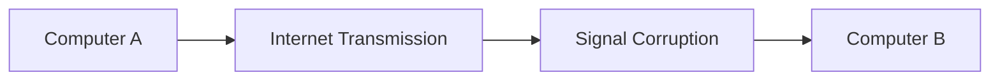
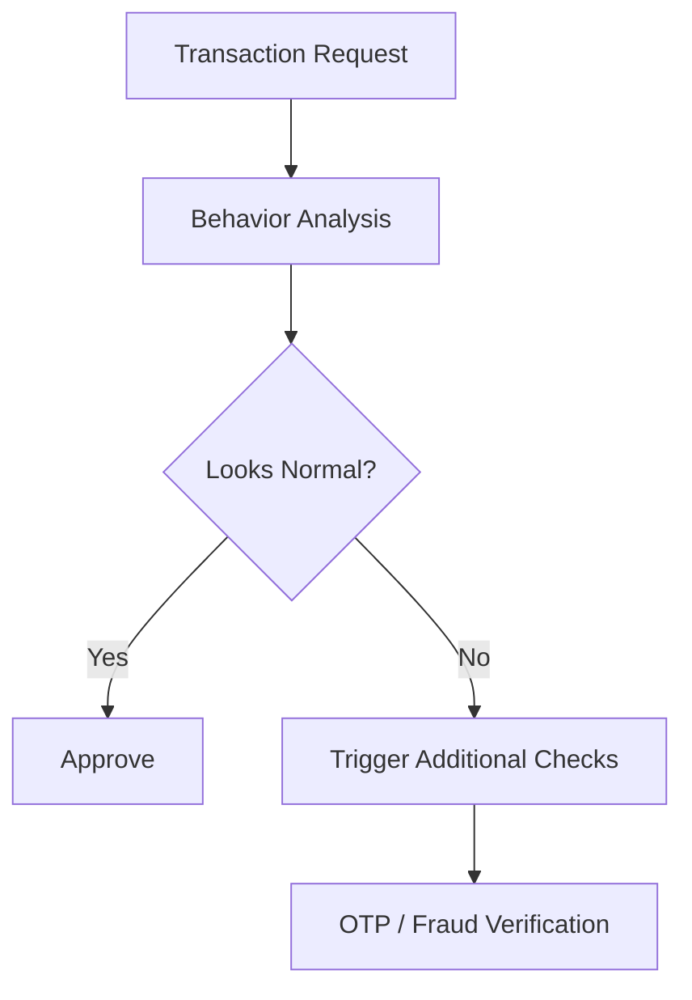
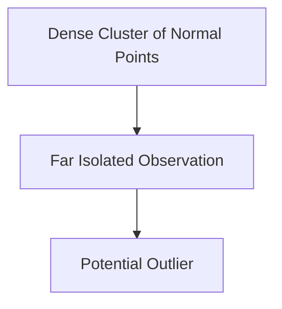
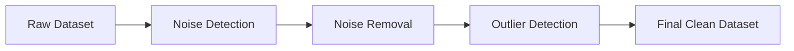

## Index

1. Introduction to Noise and Outliers
    
2. Understanding Data Noise
    
3. Causes of Noisy Data
    
4. Faulty Data Collection Instruments
    
5. Human Data Entry Errors
    
6. Data Transmission Errors
    
7. Technological Limitations
    
8. Understanding Outliers
    
9. Real-World Examples of Outlier Detection
    
10. Noise vs Outliers
    
11. Visual Understanding of Outliers
    
12. Why Outliers Matter in Machine Learning
    
13. Order of Handling: Noise Before Outliers
    
14. Key Takeaways
    

## Introduction to Noise and Outliers

Noise and outliers are two of the most important data quality problems in machine learning and data preprocessing. Although both appear unusual inside datasets, they represent fundamentally different phenomena.

Noise refers to corrupted or distorted data caused by random errors. Outliers, on the other hand, are legitimate but unusual observations that significantly differ from the majority of the dataset.

Understanding the distinction is critical because machine learning systems handle them differently.

## Understanding Data Noise

Noise refers to unwanted modification in original data values. It is essentially random error or variance introduced into measurements.

Mathematically:

$$
X_{observed} = X_{true} + \epsilon
$$

where:

- $X_{true}$ represents the actual value
    
- $\epsilon$ represents random error or variance
    

Noise is not considered a legitimate data point. It is corrupted information introduced during collection, transmission, storage, or measurement.

A noisy data point therefore becomes:

$$
\text{Noisy Data} = \text{Original Data} + \text{Random Error}
$$

## Causes of Noisy Data

Noise can emerge from several real-world operational failures.

|Cause|Description|
|---|---|
|Faulty Sensors|Malfunctioning measurement devices|
|Human Errors|Incorrect manual data entry|
|Transmission Errors|Corruption during communication|
|Technological Limitations|Low precision hardware|

The lecture emphasizes that noisy data is unavoidable in practical systems because real-world infrastructure is imperfect.

## Faulty Data Collection Instruments

One of the most common sources of noise is malfunctioning sensors.

Suppose a humidity sensor consistently adds a small error:

$$
Humidity_{measured} = Humidity_{actual} + \delta
$$

where:

- $\delta$ is the sensor error
    

Even if the error is small, repeated noisy measurements degrade downstream machine learning systems.

Example:

|Actual Humidity|Sensor Output|
|---|---|
|70%|74%|
|65%|69%|
|80%|84%|

The measurements appear valid but are systematically distorted.

## Human Data Entry Errors

Noise may also arise from manual data entry mistakes.

The lecture uses the census example:

A government worker asks how many people live in a house.

Actual answer:

$$
Members = 3
$$

Recorded answer:

$$
Members = 5
$$

This introduces accidental distortion into the dataset.

Unlike malicious corruption, this type of noise is usually unintentional and originates from operational mistakes during collection.

## Data Transmission Errors

Noise can also be introduced while transmitting data between systems.

If two computers communicate over a network:

communication noise may alter the transmitted information.

This is why networking systems use:

|Mechanism|Purpose|
|---|---|
|Checksum Bits|Validate integrity|
|Error Detection|Detect corruption|
|Error Correction|Repair damaged packets|
|Retransmission|Resend corrupted data|

The lecture references TCP/IP systems where additional bits verify whether transmitted information has been modified.

## Technological Limitations

Sometimes the issue is not malfunction but insufficient hardware precision.

Example:

A tsunami detection system requires centimeter-level precision:

$$
Precision_{required} = 0.01m
$$

However, the deployed sensor measures only in meters:

$$
Precision_{available} = 1m
$$

This limitation introduces measurement uncertainty.

Another example is humidity measurement where the system requires decimal precision but the sensor only supports integer outputs.

This creates approximation noise.

## Understanding Outliers

Outliers are fundamentally different from noise.

An outlier is:

- A legitimate data point
    
- Genuine information
    
- But statistically unusual compared to the rest of the dataset
    

Formally:

$$
x_i \in Dataset
$$

but:

$$
Distance(x_i, \mu) \gg \text{Most Other Points}
$$

Unlike noisy data, outliers are not corruption. They are real but extreme observations.

## Real-World Examples of Outlier Detection

The lecture provides multiple practical examples where outlier detection becomes critical.

## Credit Card Fraud Detection

Banks continuously analyze transaction patterns.

Most transactions follow normal behavior:

|User|Location|Amount|
|---|---|---|
|Usual Activity|Goa|₹2000|

Suddenly:

|User|Location|Amount|
|---|---|---|
|Suspicious Activity|USA|₹2,00,000|

This transaction becomes an outlier.

The system then triggers additional verification:

- OTP checks
    
- Fraud analysis
    
- Authentication layers
    

## Gmail Login Detection

The lecture also uses login anomaly detection.

Suppose a user logs into Gmail daily from Goa.

Suddenly, a login attempt occurs from Delhi.

Google treats this as an outlier because the behavior deviates from historical patterns.

The login may still be genuine, but additional verification steps become necessary.

This demonstrates an important concept:

> Outliers are not necessarily wrong.

They are simply unusual.

## Noise vs Outliers

Although both appear abnormal, their meanings differ significantly.

|Aspect|Noise|Outlier|
|---|---|---|
|Nature|Corrupted Data|Genuine Data|
|Cause|Random Error|Rare Event|
|Legitimacy|Invalid|Valid|
|Example|Sensor malfunction|Fraudulent transaction|
|Goal|Remove|Analyze carefully|

Noise should usually be cleaned or corrected.

Outliers should first be investigated because they may contain valuable insights.

## Visual Understanding of Outliers

The lecture describes outliers using a two-dimensional dataset.

Most observations cluster together while a few isolated points lie far away.

Conceptually:

|Point Type|Position|
|---|---|
|Normal Data|Near cluster center|
|Outlier|Far from cluster|

Outlier detection algorithms attempt to quantify this separation mathematically.

## Why Outliers Matter in Machine Learning

Many machine learning algorithms are highly sensitive to outliers.

For example:

|Algorithm|Sensitivity|
|---|---|
|Linear Regression|High|
|K-Means Clustering|High|
|KNN|Moderate|
|Decision Trees|Lower|

Outliers can distort:

- Mean calculations
    
- Regression slopes
    
- Distance metrics
    
- Cluster boundaries
    

A single extreme value may significantly shift model behavior.

Example:

|Salary Values|
|---|
|5 LPA|
|6 LPA|
|7 LPA|
|10 Crore|

The final value dramatically alters the mean.

## Order of Handling: Noise Before Outliers

The lecture emphasizes an important preprocessing sequence:

1. Remove noise
    
2. Detect outliers
    

Reason:

Noise itself may appear like an outlier.

If noisy points are not removed first, the system may incorrectly classify corrupted observations as genuine anomalies.

The workflow becomes:

This ordering is extremely important in practical preprocessing pipelines.

## Key Takeaways

Noise and outliers represent two fundamentally different preprocessing problems.

Noise refers to corrupted observations introduced through errors in measurement, transmission, or data collection. Outliers are genuine but statistically unusual observations.

The distinction matters because:

- Noise is typically removed
    
- Outliers are investigated
    

The lecture strongly emphasizes practical examples such as fraud detection, login anomaly detection, and sensor-based systems to show that outlier analysis is deeply connected to real-world AI systems.

A major engineering principle from the lecture is:

$$
\text{Handle Noise First} \Rightarrow \text{Detect Outliers Later}
$$

because noisy observations can falsely appear anomalous.

Tags: #statistics #machine-learning #data-science #statistical-modelling
