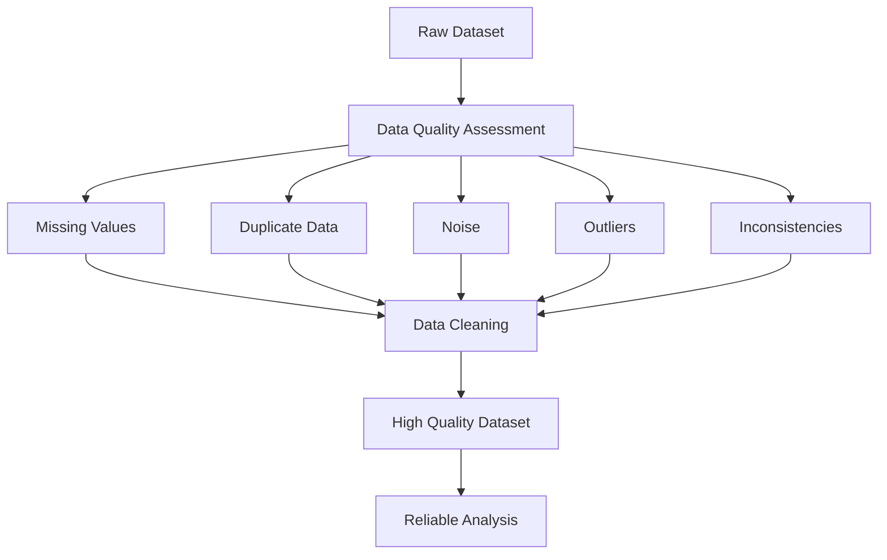

# Week 3: Data Quality and Issues

## Overview

Data quality is one of the most critical factors determining the success of any Data Science, Machine Learning, or Business Intelligence project. The quality of analytical results depends heavily on the quality of the underlying data.

Real-world datasets are rarely perfect. They often contain missing values, duplicate records, noise, inconsistencies, outliers, and other quality problems that can negatively impact analysis and predictive modeling.

This week introduces the concept of data quality, explores common data quality issues encountered in practice, and demonstrates techniques for identifying these problems within datasets. Understanding these issues is an essential prerequisite for effective data preprocessing and reliable knowledge discovery.

The topics covered in this week form the foundation for data cleaning, feature engineering, exploratory data analysis, and machine learning.

## Learning Objectives

After completing this week, you should be able to:

- Define data quality and explain its importance.
- Identify common data quality problems in datasets.
- Distinguish between missing values and duplicate data.
- Differentiate noise from outliers.
- Analyze datasets to detect data quality issues.
- Understand the impact of poor-quality data on analytical outcomes.
- Apply practical techniques to identify and assess data quality problems.

## Topics Covered

### 1. [Introduction to Data Quality & Issues](Introduction%20to%20Data%20Quality%20%26%20Issues.md)

This topic introduces the concept of data quality and explains why maintaining high-quality data is essential for accurate analysis and decision making.

Key concepts include:

- Definition of data quality
- Dimensions of data quality
- Importance of high-quality data
- Sources of poor-quality data
- Impact of data quality on analytics and machine learning

Common data quality dimensions include:

- Accuracy
- Completeness
- Consistency
- Timeliness
- Validity
- Uniqueness

Understanding these dimensions helps organizations evaluate the fitness of data for analytical purposes.

### 2. [Example of Data Quality Issues](Example%20of%20Data%20Quality%20Issues.md)

Real-world datasets frequently exhibit multiple quality issues simultaneously.

This topic presents practical examples of common problems such as:

- Missing values
- Duplicate records
- Inconsistent formats
- Typographical errors
- Invalid values
- Incomplete records
- Contradictory information

Studying these examples helps learners recognize similar issues in real analytical projects.

### 3. [Missing Values vs Duplicate Data](Missing%20Values%20vs%20Duplicate%20Data.md)

Two of the most frequently encountered data quality problems are missing values and duplicate records.

This section explores:

#### Missing Values

Occurs when data is absent or unavailable.

Examples:

- Missing customer age
- Empty email addresses
- Null sales amounts

Common causes include:

- Data entry errors
- Sensor failures
- Non-response during surveys

#### Duplicate Data

Occurs when the same observation appears multiple times within a dataset.

Examples:

- Duplicate customer records
- Repeated transactions
- Multiple entries for the same event

Understanding the distinction between these issues is essential for selecting appropriate data cleaning strategies.

### 4. [Noise vs Outliers](Noise%20vs%20Outliers.md)

Although often confused, noise and outliers represent different types of data abnormalities.

#### Noise

Noise refers to random errors or meaningless variations present in data.

Examples:

- Typographical mistakes
- Sensor inaccuracies
- Random measurement errors

#### Outliers

Outliers are observations that significantly deviate from the majority of the data.

Examples:

- Extremely high purchase amounts
- Unusually low temperatures
- Rare but valid business events

Identifying whether unusual observations represent noise or genuine outliers is crucial because improper handling can lead to inaccurate analytical conclusions.

### 5. [Lab 3.1: Explore Various Data Quality Issues](Lab%203.1_%20Explore%20various%20data%20quality%20issues%20that%20can%20be%20present%20in%20a%20dataset.ipynb)

This practical laboratory exercise provides hands-on experience in identifying and exploring data quality issues within real datasets.

Activities may include:

- Detecting missing values
- Identifying duplicate records
- Exploring inconsistent values
- Discovering outliers
- Assessing dataset completeness
- Generating summary statistics
- Visualizing anomalies

The lab bridges theoretical concepts with practical implementation using Python and data analysis libraries.

### 6. [Week 3 Data Quality and Issues](Week%203%20Data%20Quality%20and%20Issues.md)

This document serves as the primary lecture material for Week 3 and consolidates all concepts related to data quality assessment and common data problems.

It provides an integrated understanding of:

- Data quality principles
- Types of data quality issues
- Identification techniques
- Practical examples
- Analytical implications

## Conceptual Relationship

## Week Navigation

| Resource | Description |
|-----------|-------------|
| [Introduction to Data Quality & Issues](Introduction%20to%20Data%20Quality%20%26%20Issues.md) | Introduction to data quality concepts and dimensions |
| [Example of Data Quality Issues](Example%20of%20Data%20Quality%20Issues.md) | Practical examples of common data quality problems |
| [Missing Values vs Duplicate Data](Missing%20Values%20vs%20Duplicate%20Data.md) | Comparison of two common data quality issues |
| [Noise vs Outliers](Noise%20vs%20Outliers.md) | Understand the differences between noise and outliers |
| [Week 3 Data Quality and Issues](Week%203%20Data%20Quality%20and%20Issues.md) | Consolidated lecture notes for Week 3 |
| [Lab 3.1: Explore Various Data Quality Issues](Lab%203.1_%20Explore%20various%20data%20quality%20issues%20that%20can%20be%20present%20in%20a%20dataset.ipynb) | Hands-on exploration of data quality problems |

## Key Takeaways

- High-quality data is essential for reliable analytics and machine learning.
- Real-world datasets frequently contain multiple quality issues.
- Missing values and duplicate records require different handling strategies.
- Noise and outliers are distinct phenomena and should not be treated identically.
- Identifying data quality problems is a fundamental step in data preprocessing.
- Effective data cleaning improves analytical accuracy and model performance.

## Prerequisites for Future Topics

The concepts introduced in this week provide the foundation for:

- Data Cleaning
- Data Integration
- Data Transformation
- Feature Engineering
- Exploratory Data Analysis (EDA)
- Statistical Modeling
- Machine Learning
- Data Mining
