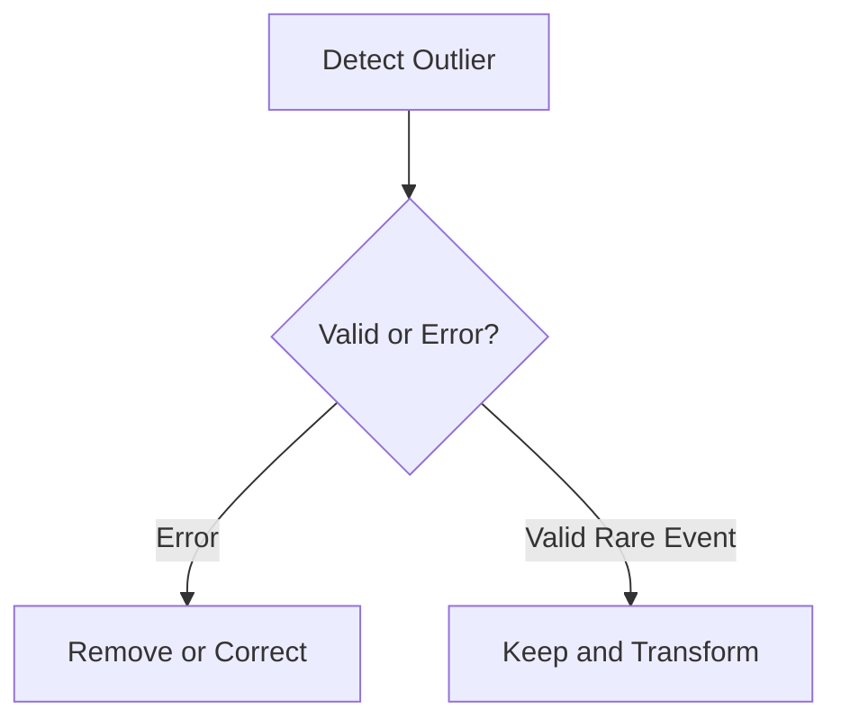

# Handling Outliers

The simplest handling strategy is direct deletion.

However, blindly deleting outliers can cause:

- Loss of information
    
- Statistical bias
    
- Removal of meaningful rare events
    

Therefore, outliers must first be investigated.

The workflow becomes:

