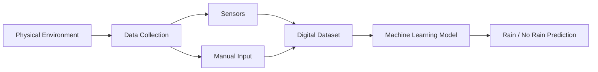

# Physical World to Digital Data Conversion

Machine learning systems first observe physical entities from the real world and then convert them into digital representations.

The lecture uses weather prediction as the core example.

Suppose the question is:

> Will it rain tomorrow?

To answer this question, the system must collect multiple environmental parameters.

|Physical Parameter|Collection Method|
|---|---|
|Humidity|Sensor|
|Wind Speed|Sensor|
|Wind Direction|Sensor|
|Season|Manual or automated entry|
|Cloud Formation|Sensor/Image System|

These physical observations are then transformed into digital tabular data.

