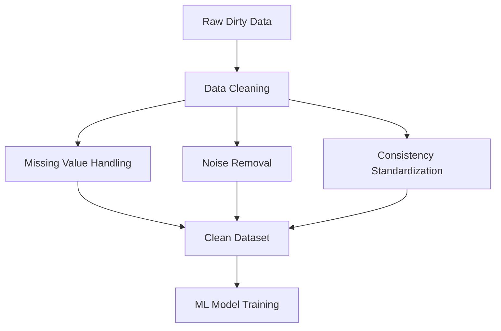

# Why Data Cleaning is Necessary

Machine learning algorithms rely on mathematical computations.

If datasets contain missing or corrupted values, many algorithms cannot execute properly.

The preprocessing workflow therefore becomes:

Without cleaning, downstream predictions become unreliable.
