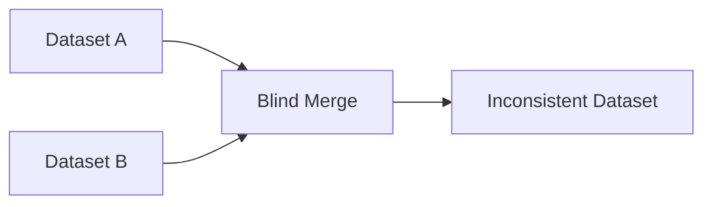

# Causes of Data Inconsistency

The lecture identifies several practical reasons why inconsistency emerges in real-world systems.

|Cause|Description|
|---|---|
|Human Error|Incorrect manual entry|
|System Glitches|Software-related corruption|
|Data Integration|Merging incompatible datasets|
|Lack of Standards|No common formatting rules|
|Schema Differences|Different database structures|

The most common reason is blind integration of heterogeneous data sources.

