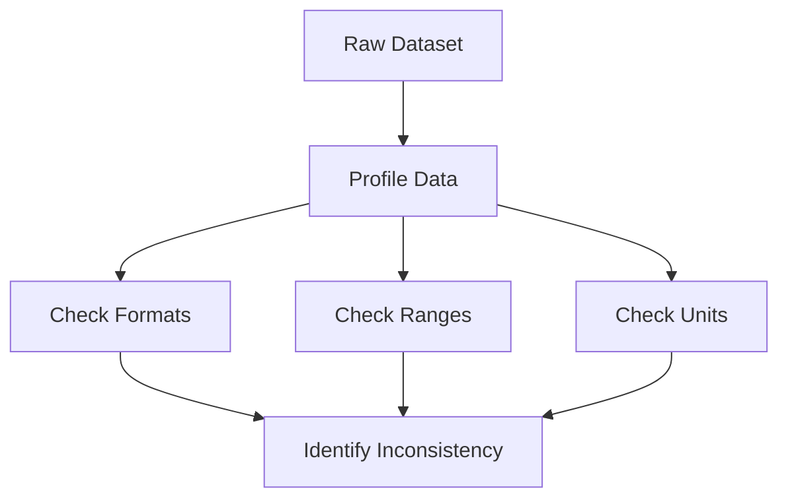

# Detecting Inconsistency

One major strategy is data profiling.

Data analysts inspect:

- Distribution patterns
    
- Column formats
    
- Frequency distributions
    
- Type consistency
    
- Data ranges
    

The objective is to identify irregular patterns that violate expected standards.

