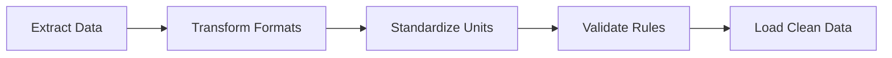

# ETL and Data Harmonization

The lecture references ETL systems:

- Extract
    
- Transform
    
- Load
    

ETL pipelines transform heterogeneous datasets into a standardized structure before storage or analysis.

ETL systems are critical in enterprise-scale analytics because most organizations collect data from multiple incompatible systems.
