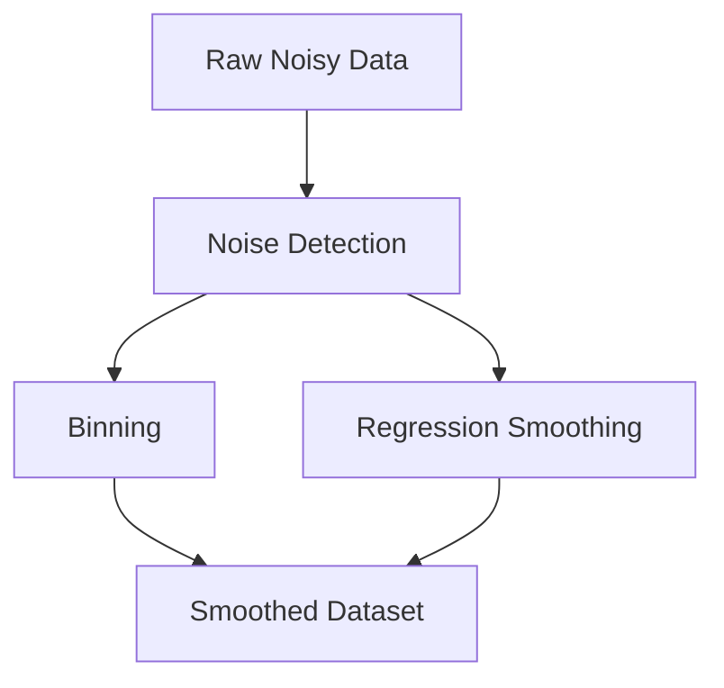

# Noise Handling Techniques

The lecture introduces two major smoothing techniques:

|Method|Core Idea|
|---|---|
|Binning|Local averaging inside groups|
|Regression|Fit trend line/curve|

The goal is not necessarily to remove data points completely, but to reduce the impact of random fluctuations.

