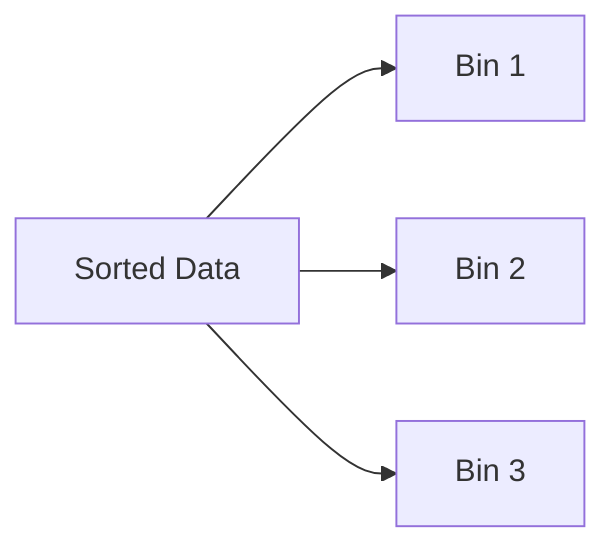

# Binning for Noise Smoothing

Binning is one of the simplest smoothing techniques.

The idea is:

1. Sort the data
    
2. Divide it into bins
    
3. Replace values using local statistics
    

This reduces local fluctuation caused by noisy observations.

Suppose the dataset is:

|Original Values|
|---|
|4|
|8|
|15|
|21|
|21|
|24|
|25|
|28|
|34|

After sorting, the data is partitioned into equal-sized bins.

