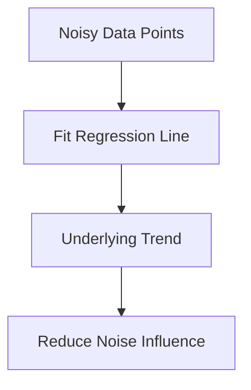

# Regression and Trend Modeling

Regression attempts to estimate the true relationship hidden beneath noisy observations.

Conceptually:

The regression surface may be:

|Type|Shape|
|---|---|
|Linear Regression|Straight line|
|Polynomial Regression|Curve|
|Multivariate Regression|Hyperplane|

The fitted model smooths fluctuations and reveals the dominant structural pattern inside the data.
