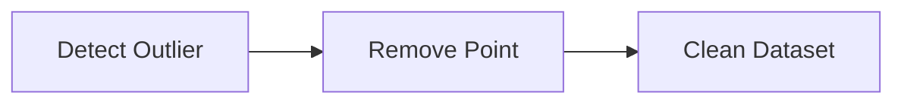

# 10.1 Direct Removal

The simplest strategy is deleting the outlier from the dataset.

```mermaid
flowchart LR
    A[Detect Outlier]
    --> B[Remove Point]

    B --> C[Clean Dataset]
```

This reduces distortion but risks losing valuable information.
