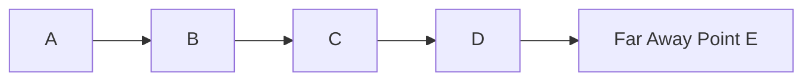

# Visualizing Outliers in 1D and 2D Space

The lecture explains outliers using both one-dimensional and two-dimensional examples.

# One-Dimensional View

Point E is isolated from the rest of the distribution.
