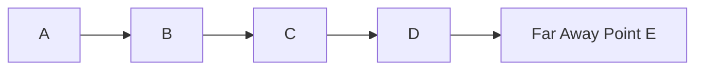
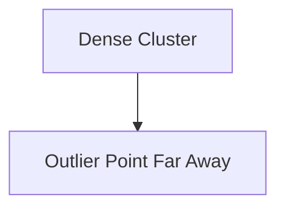

# Visualizing Outliers in 1D and 2D Space

The lecture explains outliers using both one-dimensional and two-dimensional examples.

# One-Dimensional View

Point E is isolated from the rest of the distribution.

# Two-Dimensional View

In two-dimensional space, most observations form a dense cluster while the outlier remains isolated.

The key property is:

$$
Similarity \downarrow \quad as \quad Distance \uparrow
$$
