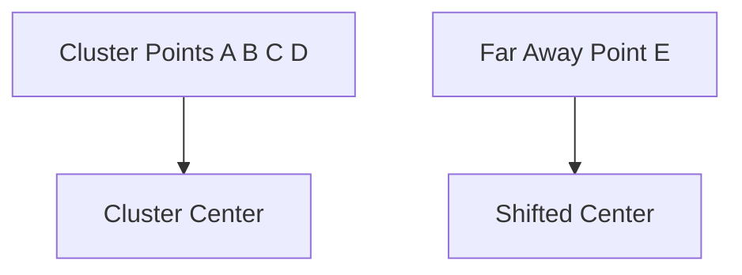

# Outliers and Clustering Algorithms

The lecture specifically discusses center-based clustering algorithms.

Suppose:

Without the outlier, the cluster center lies near the dense region.

Once the outlier is included, the center shifts unnaturally.

This affects algorithms such as:

|Algorithm|Sensitivity|
|---|---|
|K-Means|High|
|Agglomerative Clustering|High|

Cluster centroids are computed using averages:

Centroid=\frac{1}{n}\sum_{i=1}^{n}x_i

Extreme points therefore distort the center significantly.
