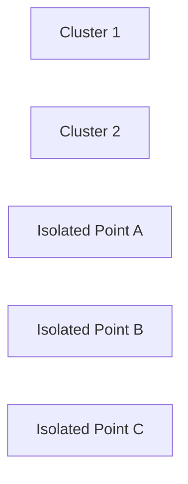

# 8.3 Clustering-Based Detection

Clustering algorithms group similar observations together.

Points outside cluster boundaries become potential outliers.

The isolated points do not belong naturally to any dense group.
