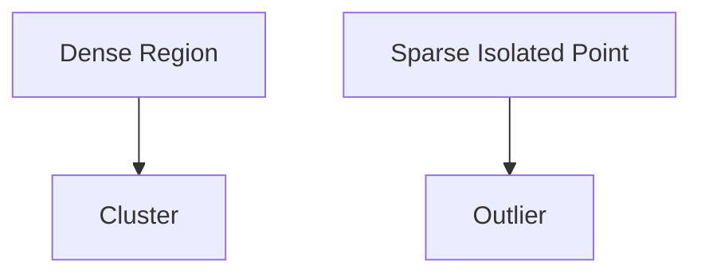

# DBSCAN and Density-Based Clustering

The lecture highlights DBSCAN as an important density-based clustering algorithm.

Unlike K-Means, DBSCAN does not rely on cluster centers.

Instead, it identifies dense neighborhoods.

Advantages:

|Property|DBSCAN|
|---|---|
|Center-Based|No|
|Sensitive to Outliers|Less|
|Detects Arbitrary Shapes|Yes|
|Detects Noise Naturally|Yes|

DBSCAN naturally separates sparse points as outliers.

