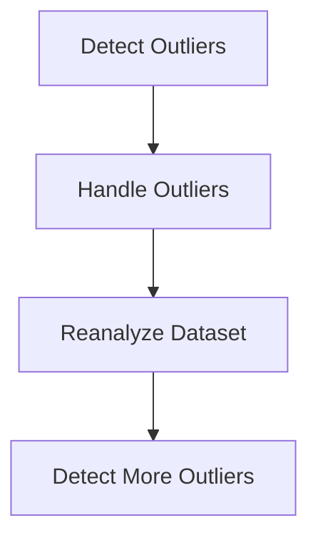

# Iterative Nature of Outlier Analysis

Outlier analysis is not a one-time preprocessing step.

The workflow becomes iterative:

```mermaid
flowchart TD
    A[Detect Outliers]
    --> B[Handle Outliers]

    B --> C[Reanalyze Dataset]

    C --> D[Detect More Outliers]
```

The dataset must repeatedly be reviewed and refined.
