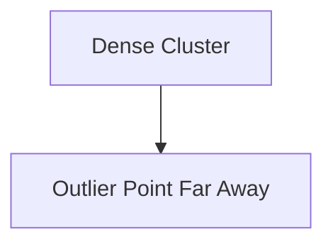

# Two-Dimensional View

In two-dimensional space, most observations form a dense cluster while the outlier remains isolated.

The key property is:

$$
Similarity \downarrow \quad as \quad Distance \uparrow
$$
