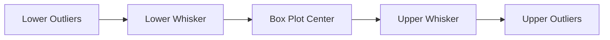
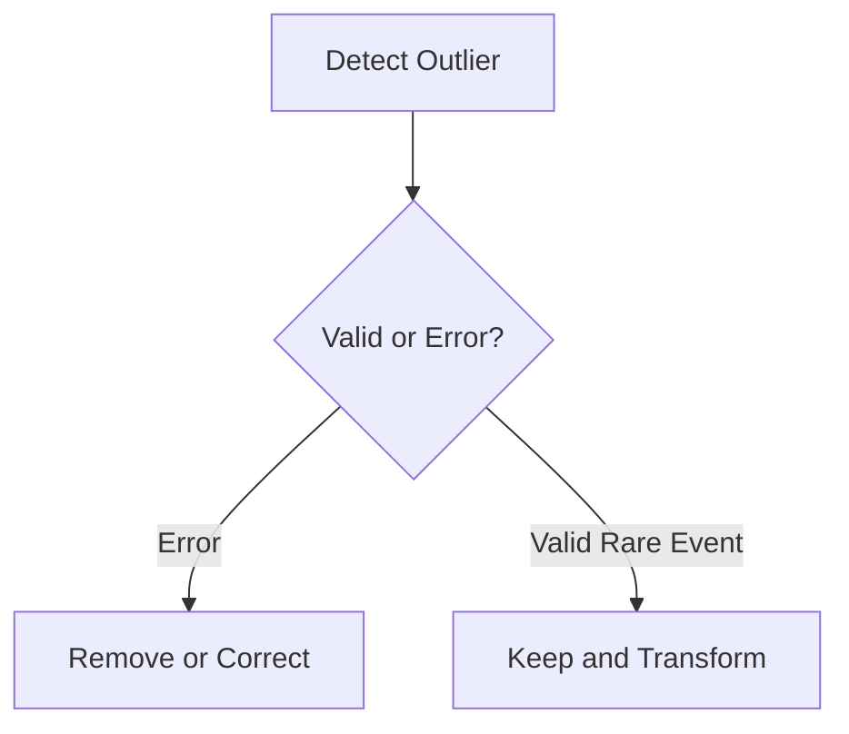

# Index

1. Introduction to Outlier Handling
    
2. Defining Outliers
    
3. Types of Outliers  
    3.1 Error Outliers  
    3.2 Novelty and Interesting Event Outliers
    
4. Why Outliers Matter
    
5. Influence of Outliers on Statistics
    
6. Influence on Machine Learning Models
    
7. Visual Detection Using Box Plots
    
8. Statistical Detection Using Z-Score
    
9. Handling Outliers
    
10. Normalization and Transformation
    
11. Golden Rule of Outlier Handling
    
12. Key Takeaways
    

# Introduction to Outlier Handling

Outlier detection is one of the most important stages in data cleaning because unusual observations can heavily distort statistical analysis and machine learning models.

An outlier is a data point that differs significantly from the majority of observations in the dataset. These points may represent either genuine rare events or incorrect data generated due to errors.

The major challenge is that not all outliers are bad. Some are valuable signals.

# Defining Outliers

An outlier is a data point whose characteristics are considerably different from the rest of the dataset.

Consider a simple one-dimensional dataset:

|Point|Value|
|---|---|
|A|1|
|B|2|
|C|3|
|D|100|

Points A, B, and C are clustered closely together, while point D lies far away.

This makes D an outlier.

Conceptually:

$$  
Distance(x_i,\mu) \gg \text{Normal Points}  
$$

where:

- $x_i$ is the observation
    
- $\mu$ is the central tendency of the dataset
    

# Types of Outliers

The lecture divides outliers into two major categories.

|Type|Meaning|
|---|---|
|Error Outliers|Incorrect or illegitimate observations|
|Novelty Outliers|Genuine but rare observations|

This distinction is extremely important because both types require different handling strategies.

## 3.1 Error Outliers

Error outliers are invalid observations created due to mistakes during collection, preprocessing, or measurement.

### Data Entry Error

Suppose a person’s age is entered incorrectly:

|Actual Age|Recorded Age|
|---|---|
|50|150|

Since human age rarely exceeds 120:

$$  
Age = 150  
$$

becomes an obvious outlier.

### Faulty Sensor Example

Suppose a weather sensor records:

$$  
Temperature = -100^\circ C  
$$

for a tropical region.

This is physically unrealistic and therefore represents an error outlier.

These observations are usually removed or corrected because they do not represent meaningful real-world behavior.

## 3.2 Novelty and Interesting Event Outliers

Novelty outliers are legitimate observations that occur rarely but carry important information.

These points are not errors.

They often represent critical events.

### Credit Card Fraud Detection

Banks monitor transaction behavior continuously.

Most transactions follow predictable spending patterns.

A sudden transaction from another country may appear as an outlier:

|Normal Behavior|Outlier Behavior|
|---|---|
|Goa|USA|
|₹2000|₹2,00,000|

The outlier may indicate fraud.

### System Failure Detection

Suppose a server normally operates under stable voltage and temperature conditions.

Suddenly:

$$  
Voltage \uparrow  
$$

or:

$$  
Temperature \uparrow  
$$

causes abnormal behavior.

This spike becomes an outlier that may indicate system failure.

### Bill Gates Example

The lecture uses Bill Gates as a valid statistical outlier.

If income distributions are plotted globally, his wealth lies extremely far from the majority of observations.

The point is rare but genuine.

# Why Outliers Matter

Outliers significantly affect statistical calculations because many mathematical operations depend on all observations.

A single extreme value may distort:

- Mean
    
- Variance
    
- Standard deviation
    
- Regression boundaries
    
- Cluster centroids
    

This becomes dangerous because machine learning algorithms rely heavily on these calculations.

# Influence of Outliers on Statistics

The lecture demonstrates this using mean calculation.

Normal dataset:

|Values|
|---|
|1|
|2|
|3|

Mean:

\bar{x}=\frac{1+2+3}{3}=2

Now introduce an outlier:

|Values|
|---|
|1|
|2|
|300|

New mean:

\bar{x}=\frac{1+2+300}{3}=101

A single extreme observation shifts the average dramatically.

This illustrates why outliers are dangerous in statistical analysis.

# Influence on Machine Learning Models

Many machine learning algorithms are highly sensitive to extreme observations.

|Algorithm|Outlier Sensitivity|
|---|---|
|Linear Regression|Very High|
|K-Means Clustering|Very High|
|KNN|Moderate|
|Decision Trees|Lower|

## Linear Regression

Linear regression minimizes squared error:

$$  
\sum (y_i - \hat{y}_i)^2  
$$

A large outlier drastically increases this error term and shifts the regression line.

## Clustering

In clustering algorithms such as K-Means:

$$  
Centroid = \frac{1}{n}\sum x_i  
$$

Outliers can drag cluster centroids away from dense regions and distort grouping structure.

# Visual Detection Using Box Plots

One of the most common visual methods for detecting outliers is the box plot.

A box plot summarizes the dataset using:

|Component|Meaning|
|---|---|
|Q1|First Quartile|
|Q2|Median|
|Q3|Third Quartile|
|IQR|Interquartile Range|
|Whiskers|Expected data spread|

The interquartile range is:

$$  
IQR = Q3 - Q1  
$$

Outlier boundaries are typically defined as:

Lower\ Bound = Q1 - 1.5(IQR)

Upper\ Bound = Q3 + 1.5(IQR)

Any point outside these whiskers becomes a potential outlier.

# Statistical Detection Using Z-Score

Another common method is Z-score analysis.

The Z-score measures how many standard deviations a point lies away from the mean.

genui{"math_block_widget_always_prefetch_v2":{"content":"Z=\frac{x-\mu}{\sigma}"}}

where:

- $x$ = observation
    
- $\mu$ = mean
    
- $\sigma$ = standard deviation
    

A large absolute Z-score suggests an outlier.

Typically:

|Z-Score|Interpretation|
|---|---|
|\|Z\| < 2|Normal|
|2 < \|Z\| < 3|Suspicious|
|\|Z\| > 3|Likely Outlier|

Most normal observations lie within:

$$  
-3\sigma \leq x \leq 3\sigma  
$$

# Handling Outliers

The simplest handling strategy is direct deletion.

However, blindly deleting outliers can cause:

- Loss of information
    
- Statistical bias
    
- Removal of meaningful rare events
    

Therefore, outliers must first be investigated.

The workflow becomes:

# Normalization and Transformation

Instead of removing genuine outliers, preprocessing systems often reduce their influence using normalization techniques.

Examples include:

|Technique|Purpose|
|---|---|
|Min-Max Scaling|Compress range|
|Z-Score Normalization|Standardize distribution|
|Log Transformation|Reduce skewness|

These methods preserve the information while reducing extreme statistical influence.

# Golden Rule of Outlier Handling

The lecture emphasizes a critical principle:

> Never remove an outlier simply because it is an outlier.

Outliers may represent:

- Fraud
    
- System failure
    
- Cyber intrusion
    
- Rare biological event
    
- Wealth inequality
    
- Medical anomaly
    

Blind deletion may destroy valuable information.

The correct approach is:

1. Detect
    
2. Investigate
    
3. Classify
    
4. Decide treatment
    

# Key Takeaways

Outliers are observations that significantly differ from the majority of a dataset. Some outliers are errors while others are legitimate rare events.

The lecture strongly emphasizes that outliers influence both statistical calculations and machine learning models because many algorithms depend on averages, variances, distances, and optimization functions.

Important detection techniques include:

|Method|Type|
|---|---|
|Box Plot|Visual|
|Z-Score|Statistical|

The most important engineering lesson is that outliers should not be removed blindly. Their meaning must first be understood because rare events often contain the most valuable information in real-world systems.